# Architecture Response Document

> **Pulse Patrol**
>
> *Develop a software system for healthcare that collects and manages patient data,
> integrates with medical equipment, provides web access for patients and authorized personnel,
> alerts staff for abnormal values, and supports patient transfers between healthcare providers.*

<!-- TOC -->
* [Architecture Response Document](#architecture-response-document)
  * [1. Context](#1-context)
    * [Scope](#scope)
      * [Personas](#personas)
      * [Use cases](#use-cases)
          * [Use Case 1 (Patient)](#use-case-1-patient)
          * [Use Case 2 (Doctor)](#use-case-2-doctor)
          * [Use Case 3 (Doctor)](#use-case-3-doctor)
          * [Use Case 4 (Support Staff)](#use-case-4-support-staff)
          * [Use Case 5 (Administrator)](#use-case-5-administrator)
          * [Use Case 6 (Administrator)](#use-case-6-administrator)
    * [Out of Scope](#out-of-scope)
  * [2. Proposed Approach](#2-proposed-approach)
    * [Strategy and Architectural Goals](#strategy-and-architectural-goals)
    * [System Context (C4 Level 1)](#system-context-c4-level-1)
  * [3. Individual Components Roles and Responsibilities](#3-individual-components-roles-and-responsibilities)
    * [Use Case Realization](#use-case-realization)
      * [Use Case 1 (Patient)](#use-case-1-patient-1)
      * [Use Case 2 (Doctor)](#use-case-2-doctor-1)
      * [Use Case 3 (Doctor)](#use-case-3-doctor-1)
      * [Use Case 4 (Support Staff)](#use-case-4-support-staff-1)
      * [Use Case 5 (Administrator)](#use-case-5-administrator-1)
      * [Use Case 6 (Administrator)](#use-case-6-administrator-1)
  * [4. Deployment](#4-deployment)
  * [5. Dependencies](#5-dependencies)
  * [6. Data Flows/APIs](#6-data-flowsapis)
  * [7. Security Concerns](#7-security-concerns)
  * [8. COGS](#8-cogs)
<!-- TOC -->

## 1. Context

### Scope

[//]: # (<<Main system/feature requirements &#40;functional & non-functional&#41;>>)

[//]: # (S: <business-requirements>)

Develop a software system that:

1. Collects data about patients: medical records, test results, admission forms, etc.
2. Collects data from medical equipment used for investigations.
3. The data is accessible to patients through a web application.
4. Doctors and authorized personnel have access to the data of patients admitted to the hospitals where they work.
5. The system allows for alerting medical staff when monitoring systems detect abnormal values.
6. The system can be sold to various healthcare companies and facilitates the transfer of patients from one to another.

[//]: # (S: </business-requirements>)

#### Personas

[//]: # (S: <personas>)

1. **Patient**: Individual receiving medical care or treatment.
    - R3: Patients require access to their health data via a web application.

2. **Doctor**: Medical professional providing care to patients.
    - R4: Doctors require access to the data of patients admitted to the hospitals where they work.
    - R5: They need to receive alerts to respond quickly to patient needs.

3. **Support Staff**: Support personnel assisting in patient care (e.g. nurses).
    - R5: Medical staff need alerts for abnormal values in patient monitoring.

4. **Administrator**: Manager overseeing the healthcare operation.
    - R1: Administrators need to manage patient records effectively.
    - R6: They facilitate patient transfers and ensure proper data handling.

[//]: # (S: </personas>)

#### Use cases

[//]: # (S: <use-cases>)

###### Use Case 1 (Patient)

As a **Patient**,
I want **to access my medical records, test results, and admission forms through a web application**,
so that **I can stay informed about my health status and treatment progress**.

###### Use Case 2 (Doctor)

As a **Doctor**,
I want **to access the data of my patients admitted to the hospital**,
so that **I can provide informed medical care based on their history and current status**.

###### Use Case 3 (Doctor)

As a **Doctor**,
I want **to receive alerts for abnormal values detected by monitoring systems**,
so that **I can respond quickly to critical patient needs and improve outcomes**.

###### Use Case 4 (Support Staff)

As a **Support Staff Member**,
I want **to receive alerts for abnormal values in patient monitoring**,
so that **I can act swiftly to provide necessary medical assistance and ensure patient safety**.

###### Use Case 5 (Administrator)

As an **Administrator**,
I want **to manage patient records effectively**,
so that **I can maintain accurate and up-to-date information for efficient healthcare management**.

###### Use Case 6 (Administrator)

As an **Administrator**,
I want **to facilitate the transfer of patients between healthcare companies**,
so that **I can ensure continuity of care and proper handling of patient data**.

[//]: # (S: </use-cases>)

### Out of Scope

[//]: # (<<What functional & non-functional requirements we won’t cover in this ARD.>>)

The following items are explicitly excluded from the current architectural design and implementation phase:

- **Medical Equipment Manufacturing/Hardware**: The system integrates with existing equipment via the Integration
  Gateway but does not include the design, maintenance, or manufacturing of the medical hardware itself.

- **Automated Medical Diagnosis**: While the system alerts for "abnormal values" based on predefined thresholds, it will
  not provide automated clinical diagnoses or suggest pharmaceutical treatments (AI-driven medical advice).

- **Direct Billing & Insurance Claims**: Integration with billing systems or processing insurance claims (revenue cycle
  management) is excluded; the focus remains on clinical data and patient transfers.

- **Offline Data Collection**: The system requires an active network connection for real-time alerting. Offline
  buffering and asynchronous syncing from medical devices are not supported in this version.

- **Legal Responsibility for Triage**: The software acts as a communication and monitoring aid. It does not replace the
  professional judgment of medical staff or serve as the primary legal record for emergency dispatch.

- **Identity Provisioning**: The system will integrate with existing Identity Providers (IdP) but will not manage the
  primary creation or physical verification of government-issued identities for patients.

## 2. Proposed Approach

[//]: # (<<How we plan to address the requirements described in the section above. 
The section can include references to ADRs.
It should include a high level C4 context diagram.>>)

The Pulse Patrol architecture is designed to balance the high-availability required for real-time medical alerting with
the strict data isolation and security necessary for multi-tenant healthcare SaaS.

### Strategy and Architectural Goals

- **Microservices Orchestration**: To ensure scalability and independent deployment of the Patient Management and
  Telemetry
  services.

- **Real-time Stream Processing**: Utilizing a pub/sub model (e.g., Kafka or RabbitMQ) to handle high-frequency data
  from
  medical equipment with sub-second latency for alerts.

- **Multi-Tenancy**: A logical isolation strategy allowing the software to be sold to multiple healthcare providers
  while
  ensuring data remains siloed per organization.

- **Interoperability**: Adherence to healthcare standards (like HL7 FHIR) to facilitate seamless patient transfers and
  legacy
  system syncing.

### System Context (C4 Level 1)

The diagram below illustrates how Pulse Patrol sits at the center of the healthcare ecosystem, bridging the gap between
hardware, legacy data, and end-users.

```mermaid
graph LR
    classDef depExt fill: #f8a3a3, stroke: #333, stroke-width: 1.5px;
    classDef depInt fill: #a8e6a1, stroke: #333, stroke-width: 1.5px;
    classDef theSys fill: #92c6ff, stroke: #333, stroke-width: 1.5px;
    classDef groups fill: #f8f8f8, stroke: #333, stroke-width: 1.5px;
    subgraph Legend [Legend]
        direction TB
        L1["External Dependency"]:::depExt
        L2["Internal Dependency"]:::depInt
        L3["Core System"]:::theSys
    end
    subgraph Diagram ["Context Diagram"]
        direction LR
    %% Actors
        subgraph ExternalUsers ["External Users"]
            P(("«person»<br/>👥 Patient&nbsp;")):::depExt
        end

        subgraph InternalUsers ["Internal Users"]
            D(("«person»<br/>👤 Doctor&nbsp;")):::depInt
            S(("«person»<br/>👤 Support&nbsp;<br/>Staff")):::depInt
            A(("«person»<br/>👤 Admin&nbsp;")):::depInt
        end

    %% Core
        PP["«software system»<br/>🫀 Pulse Patrol&nbsp;"]:::theSys
    %% Externals
        subgraph InternalInfrastructure ["Internal Systems"]
            ME["«software system»<br/>📠 Medical Equip.&nbsp;"]:::depInt
            IS["«software system»<br/>💾 Legacy Systems&nbsp;"]:::depInt
        end

        subgraph ExternalInfrastructure ["External Systems"]
            EP["«software system»<br/>🌐 External Peers&nbsp;"]:::depExt
        end

    %% Relationships with concise text
        P -- Accesses records --> PP
        D -- Monitors & Alerts --> PP
        S -- Receives Alerts --> PP
        A -- Manages Transfers --> PP
        PP -- Ingests data from --> ME
        PP <-- Syncs data --> IS
        PP <-- Exchanges data --> EP

    end
%% Styles
    class ExternalUsers groups
    class InternalUsers groups
    class InternalInfrastructure groups
    class ExternalInfrastructure groups
```

## 3. Individual Components Roles and Responsibilities

[//]: # (<<For each component describe its role and responsibility.
Add container/component and other UML diagrams if needed &#40;sequence&#41;>>)

The system will be decomposed into the following functional units:

[//]: # (S: <functional-units>)

- **Web Portal**: Interface for Patients to view records and for Administrators to manage data.
- **Clinical Dashboard**: Specialized interface for Doctors and Support Staff to monitor live telemetry and patient
  data.
- **Patient Management Service**: Core logic for medical records, admission forms, and inter-company transfers.
- **Telemetry & Alerting Service**: Processes real-time data from medical equipment and triggers notifications for
  abnormal values.
- **Data Storage**: Centralized repository for structured medical records and time-series telemetry data.
- **Integration Gateway**: Handles communication with Legacy Systems, Medical Equipment, and Peer Healthcare Companies.

```mermaid
graph TB
    classDef depExt fill: #f8a3a3, stroke: #333, stroke-width: 1.5px;
    classDef depInt fill: #a8e6a1, stroke: #333, stroke-width: 1.5px;
    classDef theSys fill: white, stroke: #333, stroke-width: 1.5px;
    classDef container fill: #92c6ff, stroke: #333, stroke-width: 1.5px;
    subgraph Legend [Legend]
        direction TB
        L1["External Dependency"]:::depExt
        L2["Internal Dependency"]:::depInt
        L3["Core System"]:::theSys
        L4["Container"]:::container
    end
    Diagram --- Legend
    linkStyle 0 stroke-width:0px;
    
    subgraph Diagram ["Container Diagram"]
        direction TB
        Patient(("«person»<br/>👥 Patient&nbsp;")):::depExt
        Admin(("«person»<br/>👤 Admin&nbsp;")):::depInt
        Doctor(("«person»<br/>👤 Doctor&nbsp;")):::depInt
        Support(("«person»<br/>👤 Support&nbsp;<br/>Staff")):::depInt

        subgraph Pulse_Patrol_System ["«software system» 🫀 Pulse Patrol System Boundary&nbsp;"]
            Portal["«container: TBD»<br/>Web Portal&nbsp;"]:::container
            Dashboard["«container: TBD»<br/>Clinical Dashboard&nbsp;"]:::container
            PMS["«container: TBD»<br/>Patient Management&nbsp;<br/>Service"]:::container
            TAS["«container: TBD»<br/>Telemetry & Alerting&nbsp;<br/>Service"]:::container
            Storage[("«container: TBD»<br/>Data Storage&nbsp;")]:::container
            Gateway["«container: TBD»<br/>Integration Gateway&nbsp;"]:::container
        end

        Peer["«software system»<br/>🌐 Peer Healthcare Companies&nbsp;"]:::depExt
        Equipment["«software system»<br/>📠 Medical Equipment / IoT&nbsp;"]:::depInt
        Legacy["«software system»<br/>💾 Legacy Hospital Systems&nbsp;"]:::depInt
    end
%% User Interactions
    Patient -->|Views records| Portal
    Admin -->|Manages data & transfers| Portal
    Doctor -->|Monitors patients| Dashboard
    Support -->|Receives alerts| Dashboard
%% Internal Routing
    Portal -->|Requests records/transfers| PMS
    Dashboard -->|Fetches live data| TAS
    Dashboard -->|Reads history| PMS
%% Core Logic to Storage
    PMS -->|Read/Write records| Storage
    TAS -->|Store/Retrieve telemetry| Storage
%% Integration Logic
    PMS -->|Syncs data| Gateway
    TAS -->|Receives streams| Gateway
%% External System Connections
    Gateway <-->|Inter - company transfer| Peer
    Equipment -->|Real - time telemetry| Gateway
    Gateway <-->|ETL/Data sync| Legacy
%% Grouping Styling
    class Pulse_Patrol_System theSys
    style Pulse_Patrol_System fill: #33aaff, color: #fff, stroke: #333, stroke-width: 2px
    
```

[//]: # (S: </functional-units>)

### Use Case Realization

#### Use Case 1 (Patient)

As a **Patient**,
I want **to access my medical records, test results, and admission forms through a web application**,
so that **I can stay informed about my health status and treatment progress**.

```mermaid
sequenceDiagram
    actor P as «person»<br/>Patient<br/>
    participant WP as «container: TBD»<br/>Web Portal
    participant PMS as «container: TBD»<br/>Patient Management Service
    participant DS as «container: TBD»<br/>Data Storage
    P ->> WP: Request access to medical records
    WP ->> PMS: Forward request for patient data
    PMS ->> DS: Retrieve medical records
    DS -->> PMS: Send medical data
    PMS -->> WP: Provide patient data
    WP -->> P: Display medical records

```

#### Use Case 2 (Doctor)

As a **Doctor**,
I want **to access the data of my patients admitted to the hospital**,
so that **I can provide informed medical care based on their history and current status**.

```mermaid
sequenceDiagram
    actor D as «person»<br/>Doctor<br/>
    participant CD as «container: TBD»<br/>Clinical Dashboard
    participant PMS as «container: TBD»<br/>Patient Management Service
    participant TAS as «container: TBD»<br/>Telemetry & Alerting Service
    participant DS as «container: TBD»<br/>Data Storage
    D ->> CD: Select Patient Profile
%% Fetching Medical History
    CD ->> PMS: Get Patient Records (History, Labs, Admissions)
    PMS ->> DS: Query Patient History
    DS -->> PMS: Return Structured Records
    PMS -->> CD: Patient Medical History
%% Fetching Real-time Status
    CD ->> TAS: Get Live Telemetry Data
    TAS ->> DS: Query Recent Sensor Data
    DS -->> TAS: Return Time-series Data
    TAS -->> CD: Current Physiological Status
    CD -->> D: Display Integrated Patient View
```

#### Use Case 3 (Doctor)

As a **Doctor**,
I want **to receive alerts for abnormal values detected by monitoring systems**,
so that **I can respond quickly to critical patient needs and improve outcomes**.

```mermaid
sequenceDiagram
    participant ME as «software system»<br/>📠 Medical Equipment
    participant IG as «container: TBD»<br/>Integration Gateway
    participant TAS as «container: TBD»<br/>Telemetry & Alerting Service
    participant DS as «container: TBD»<br/>Data Storage
    participant CD as «container: TBD»<br/>Clinical Dashboard
    actor SS as «person»<br/>Doctor<br/>
    Note over ME, SS: Real-time Monitoring & Alerting Flow
    ME ->> IG: Stream real-time telemetry data
    IG ->> TAS: Forward data stream

    rect rgb(240, 240, 240)
        Note right of TAS: Process & Analyze Values
        TAS ->> TAS: Detect abnormal threshold breach
    end

    par Concurrent Actions
        TAS ->> DS: Store telemetry & alert record
        TAS ->> CD: Push critical alert notification
    end

    CD -->> SS: Visual/Audible Alert: "Abnormal Values Detected"
    SS ->> CD: Acknowledge alert & view patient details
    CD ->> DS: Fetch latest patient vitals
    DS -->> CD: Return historical & current data
    CD -->> SS: Display comprehensive patient status
```

#### Use Case 4 (Support Staff)

As a **Support Staff Member**,
I want **to receive alerts for abnormal values in patient monitoring**,
so that **I can act swiftly to provide necessary medical assistance and ensure patient safety**.

```mermaid
sequenceDiagram
    participant ME as «software system»<br/>📠 Medical Equipment
    participant IG as «container: TBD»<br/>Integration Gateway
    participant TAS as «container: TBD»<br/>Telemetry & Alerting Service
    participant DS as «container: TBD»<br/>Data Storage
    participant CD as «container: TBD»<br/>Clinical Dashboard
    actor D as «person»<br/>Support Staff<br/>
    Note over ME, D: Real-time Patient Monitoring Flow
    ME ->> IG: Stream Telemetry Data (e.g., Heart Rate, SpO2)
    IG ->> TAS: Forward Raw Data Stream
    TAS ->> TAS: Process & Analyze Values

    alt Abnormal Values Detected
        TAS ->> DS: Log Alert Event & Telemetry
        TAS -->> CD: Push Real-time Critical Alert
        CD -->> D: Visual/Audible Alert Notification
        D ->> CD: Acknowledge Alert & View Live Feed
        CD ->> TAS: Request Detailed Telemetry
        TAS ->> CD: Stream High-Resolution Data
    else Normal Values
        TAS ->> DS: Store Routine Telemetry
    end
    Note right of D: Doctor intervenes based on alert
```

#### Use Case 5 (Administrator)

As an **Administrator**,
I want **to manage patient records effectively**,
so that **I can maintain accurate and up-to-date information for efficient healthcare management**.

```mermaid
sequenceDiagram
    actor Admin as «person»<br/>Admin<br/>
    participant Portal as «container: TBD»<br/>Web Portal
    participant PMS as «container: TBD»<br/>Patient Management Service
    participant Storage as «container: TBD»<br/>Data Storage
    participant Gateway as «container: TBD»<br/>Integration Gateway
    participant Legacy as «software system»<br/>📠 Legacy Hospital Systems
    Admin ->> Portal: Access Patient Record
    Portal ->> PMS: Request Patient Data
    PMS ->> Storage: Fetch Record
    Storage -->> PMS: Record Data
    PMS -->> Portal: Display Record
    Admin ->> Portal: Submit Record Updates
    Portal ->> PMS: UpdatePatient(Data)

    rect rgb(240, 240, 240)
        Note over PMS, Legacy: Atomic Transaction
        PMS ->> Storage: Persist Updated Record
        Storage -->> PMS: Confirmation
        PMS ->> Gateway: Sync Update to Legacy
        Gateway ->> Legacy: Update EMR/Legacy DB
        Legacy -->> Gateway: Sync Success
        Gateway -->> PMS: Sync Acknowledged
    end

    PMS -->> Portal: Update Successful
    Portal -->> Admin: Display Success Message
```

#### Use Case 6 (Administrator)

As an **Administrator**,
I want **to facilitate the transfer of patients between healthcare companies**,
so that **I can ensure continuity of care and proper handling of patient data**.

```mermaid
sequenceDiagram
    actor Admin as «person»<br/>Admin<br/>
    participant Portal as «container: TBD»<br/>Web Portal
    participant PMS as «container: TBD»<br/>Patient Management Service
    participant Storage as «container: TBD»<br/>Data Storage
    participant Gateway as «container: TBD»<br/>Integration Gateway
    participant Peer as «software system»<br/>🌐 Peer Healthcare Company
    Note over Admin, Peer: Use Case: Transfer Patient to Another Company
    Admin ->> Portal: Select patient and target healthcare provider
    Portal ->> PMS: InitiateTransfer(patientId, targetCompanyId)
    PMS ->> Storage: FetchPatientFullRecord(patientId)
    Storage -->> PMS: Medical records, test results, history
    PMS ->> PMS: Package and Encrypt Patient Data
    PMS ->> Gateway: SendTransferRequest(targetCompanyId, encryptedData)
    Gateway ->> Peer: PostPatientTransfer(encryptedData)

    alt Transfer Successful
        Peer -->> Gateway: 201 Created (Transfer Acknowledgement)
        Gateway -->> PMS: Success Status
        PMS ->> Storage: UpdatePatientStatus(Transferred / Archived)
        PMS -->> Portal: Transfer confirmed
        Portal -->> Admin: Display "Transfer Completed Successfully"
    else Transfer Failed
        Peer -->> Gateway: Error (e.g., Validation Failed)
        Gateway -->> PMS: Error Status
        PMS -->> Portal: Transfer Failed Notification
        Portal -->> Admin: Display "Transfer Error - Please retry"
    end
```

## 4. Deployment

[//]: # (<<Include a deployment diagram and documentation about it - regions, communication, networking, etc.>>)

## 5. Dependencies

[//]: # (<<Both internal and external dependencies.
For example, Plane&Simple has an external dependency of a payment system>>)

Entities interacting with the Pulse Patrol system:

[//]: # (S: <external-entities>)

- Human Actors
    - *External*
        - **Patients** - views personal medical history, test results, and treatment progress via the web portal
    - *Internal*
        - **Doctor** - accesses patient data within their hospital and receives critical physiological alerts
        - **Support Staff Member** - nurses/assistants who receive real-time alerts for abnormal patient monitoring
          values
        - **Administrator** - manages records, oversees data integrity, and initiates inter-company patient transfers
- Technical Systems
    - *External*
        - **External Healthcare Companies Peer** - systems belonging to other providers that receive or send patient
          data during a transfer
    - *Internal*
        - **Medical Equipment** - IoT devices and monitoring hardware (e.g., bedside monitors, ventilators) that stream
          real-time telemetry
        - **Legacy Hospital Systems** - existing legacy databases or EMRs where admission forms and historical medical
          records may reside

[//]: # (S: </external-entities>)

## 6. Data Flows/APIs

[//]: # (<<Data flow diagrams. Definitions of component’s APIs>>)

## 7. Security Concerns

[//]: # (<<Authorisation, Authentication, Data encryption, Threat modelling diagram>>)

## 8. COGS

[//]: # (<<Cost estimation model for hardware, services, data storage and transfer for the whole solution>>)
