# Architecture Response Document

> **Pulse Patrol**
>
> *Develop a software system for healthcare that collects and manages patient data,
> integrates with medical equipment, provides web access for patients and authorized personnel,
> alerts staff for abnormal values, and supports patient transfers between healthcare providers.*

<!-- TOC -->
* [Architecture Response Document](#architecture-response-document)
  * [1. Context](#1-context)
    * [Scope](#scope)
      * [Personas](#personas)
      * [Use cases](#use-cases)
          * [Use Case 1 (Patient)](#use-case-1-patient)
          * [Use Case 2 (Doctor)](#use-case-2-doctor)
          * [Use Case 3 (Doctor)](#use-case-3-doctor)
          * [Use Case 4 (Support Staff)](#use-case-4-support-staff)
          * [Use Case 5 (Administrator)](#use-case-5-administrator)
          * [Use Case 6 (Administrator)](#use-case-6-administrator)
      * [Data Sources and Particularities](#data-sources-and-particularities)
        * [Patient Identification & Demographic Data](#patient-identification--demographic-data)
        * [Electronic Health Records (EHR) & Admission Forms](#electronic-health-records-ehr--admission-forms)
        * [Medical Equipment Telemetry (Real-time Monitoring)](#medical-equipment-telemetry-real-time-monitoring)
        * [Laboratory Information Systems (Test Results)](#laboratory-information-systems-test-results)
        * [Transfer & Continuity of Care Records](#transfer--continuity-of-care-records)
        * [Audit & Access Logs](#audit--access-logs)
    * [Out of Scope](#out-of-scope)
  * [2. Proposed Approach](#2-proposed-approach)
    * [Strategy and Architectural Goals](#strategy-and-architectural-goals)
    * [System Context (C4 Level 1)](#system-context-c4-level-1)
    * [Specialized Microservices](#specialized-microservices)
      * [Care & Clinical Record Service (CCRS)](#care--clinical-record-service-ccrs)
      * [Vital Stream & Alerting Service (VSAS)](#vital-stream--alerting-service-vsas)
      * [Compliance & Identity Service (CIS)](#compliance--identity-service-cis)
      * [Integration & Interop Gateway (IIG)](#integration--interop-gateway-iig)
    * [Data Flow Diagram](#data-flow-diagram)
  * [3. Individual Components Roles and Responsibilities](#3-individual-components-roles-and-responsibilities)
    * [Deployable Units (C4 Level 2)](#deployable-units-c4-level-2)
        * [Container relationships diagram](#container-relationships-diagram)
        * [Container communication diagram](#container-communication-diagram)
      * [Use Case Realization](#use-case-realization)
        * [Use Case 1 (Patient)](#use-case-1-patient-1)
        * [Use Case 2 (Doctor)](#use-case-2-doctor-1)
        * [Use Case 3 (Doctor)](#use-case-3-doctor-1)
        * [Use Case 4 (Support Staff)](#use-case-4-support-staff-1)
        * [Use Case 5 (Administrator)](#use-case-5-administrator-1)
        * [Use Case 6 (Administrator)](#use-case-6-administrator-1)
  * [4. Deployment](#4-deployment)
    * [Runtime Technologies](#runtime-technologies)
      * [Compute & Frontend (Nodes)](#compute--frontend-nodes)
      * [Data Storage & Caching](#data-storage--caching)
      * [Communication (Edges)](#communication-edges)
    * [Development & Maintenance Technologies](#development--maintenance-technologies)
    * [AWS Overview](#aws-overview)
      * [Consolidated Technology Summary](#consolidated-technology-summary)
      * [SWOT Analysis: AWS AI Technologies](#swot-analysis-aws-ai-technologies)
  * [5. Dependencies](#5-dependencies)
  * [6. Data Flows/APIs](#6-data-flowsapis)
    * [Bounded Contexts](#bounded-contexts)
      * [Care Coordination & Admissions](#care-coordination--admissions)
      * [Clinical Records](#clinical-records)
      * [Vital Signs & Monitoring](#vital-signs--monitoring)
      * [Notification & Alerting](#notification--alerting)
      * [Security & Audit (Generic)](#security--audit-generic)
  * [7. Security Concerns](#7-security-concerns)
  * [8. COGS](#8-cogs)
<!-- TOC -->

## 1. Context

### Scope

[//]: # (<<Main system/feature requirements &#40;functional & non-functional&#41;>>)

[//]: # (S: <business-requirements>)

Develop a software system that:

1. Collects data about patients: medical records, test results, admission forms, etc.
2. Collects data from medical equipment used for investigations.
3. The data is accessible to patients through a web application.
4. Doctors and authorized personnel have access to the data of patients admitted to the hospitals where they work.
5. The system allows for alerting medical staff when monitoring systems detect abnormal values.
6. The system can be sold to various healthcare companies and facilitates the transfer of patients from one to another.

[//]: # (S: </business-requirements>)

#### Personas

[//]: # (S: <personas>)

1. **Patient**: Individual receiving medical care or treatment.
    - R3: Patients require access to their health data via a web application.

2. **Doctor**: Medical professional providing care to patients.
    - R4: Doctors require access to the data of patients admitted to the hospitals where they work.
    - R5: They need to receive alerts to respond quickly to patient needs.

3. **Support Staff**: Support personnel assisting in patient care (e.g. nurses).
    - R5: Medical staff need alerts for abnormal values in patient monitoring.

4. **Administrator**: Manager overseeing the healthcare operation.
    - R1: Administrators need to manage patient records effectively.
    - R6: They facilitate patient transfers and ensure proper data handling.

[//]: # (S: </personas>)

#### Use cases

[//]: # (S: <use-cases>)

###### Use Case 1 (Patient)

As a **Patient**,
I want **to access my medical records, test results, and admission forms through a web application**,
so that **I can stay informed about my health status and treatment progress**.

###### Use Case 2 (Doctor)

As a **Doctor**,
I want **to access the data of my patients admitted to the hospital**,
so that **I can provide informed medical care based on their history and current status**.

###### Use Case 3 (Doctor)

As a **Doctor**,
I want **to receive alerts for abnormal values detected by monitoring systems**,
so that **I can respond quickly to critical patient needs and improve outcomes**.

###### Use Case 4 (Support Staff)

As a **Support Staff Member**,
I want **to receive alerts for abnormal values in patient monitoring**,
so that **I can act swiftly to provide necessary medical assistance and ensure patient safety**.

###### Use Case 5 (Administrator)

As an **Administrator**,
I want **to manage patient records effectively**,
so that **I can maintain accurate and up-to-date information for efficient healthcare management**.

###### Use Case 6 (Administrator)

As an **Administrator**,
I want **to facilitate the transfer of patients between healthcare companies**,
so that **I can ensure continuity of care and proper handling of patient data**.

[//]: # (S: </use-cases>)

#### Data Sources and Particularities

[//]: # (S: <data-sources>)

The system manages a complex flow of Protected Health Information (PHI) and Personal Identifiable Information (PII)
that requires a multi-layered approach to legal compliance and technical security.
All data must be encrypted both at rest and in transit, with strict role-based access controls ensuring
that Doctors and Support Staff only access records relevant to their specific hospital.
Under GDPR and HIPAA frameworks, the system must maintain immutable audit logs for every data interaction
to ensure accountability and patient privacy.
Furthermore, to facilitate the seamless transfer of patients between healthcare companies,
the system adheres to data portability standards, providing structured,
machine-readable exports while maintaining the integrity of real-time equipment telemetry used for critical alerting.

##### Patient Identification & Demographic Data

- *Source:* Admission forms and initial registration via the Administrator or Patient (R1).
- *Legal Owner:* The Patient (as the subject) and the Healthcare Provider (as the data controller).

##### Electronic Health Records (EHR) & Admission Forms

- *Source:* Manual entry by Administrators/Support Staff and historical records.
- *Legal Owner:* Usually the Healthcare Provider (Hospital/Clinic) where the data was generated, though patients hold
  rights to access and portability.

##### Medical Equipment Telemetry (Real-time Monitoring)

- *Source:* Direct data streams from medical equipment (e.g., heart rate monitors, ventilators).
- *Legal Owner:* The Healthcare Provider (as the entity conducting the investigation).

##### Laboratory Information Systems (Test Results)

- *Source:* External or internal diagnostic labs.
- *Legal Owner:* The Lab or the Ordering Healthcare Provider.

##### Transfer & Continuity of Care Records

- *Source:* Administrative metadata generated during patient transfers between healthcare companies.
- *Legal Owner:* Joint Ownership or delegated responsibility between the originating and receiving healthcare companies.

##### Audit & Access Logs

- *Source:* System-generated logs of Doctor, Admin, and Patient activity.
- *Legal Owner:* The Healthcare Software Operator/Company.

[//]: # (S: </data-sources>)

### Out of Scope

[//]: # (<<What functional & non-functional requirements we won’t cover in this ARD.>>)

[//]: # (S: <out-of-scope>)

The following items are explicitly excluded from the current architectural design and implementation phase:

- **Medical Equipment Manufacturing/Hardware**: The system integrates with existing equipment via the Integration
  Gateway but does not include the design, maintenance, or manufacturing of the medical hardware itself.

- **Automated Medical Diagnosis**: While the system alerts for "abnormal values" based on predefined thresholds, it will
  not provide automated clinical diagnoses or suggest pharmaceutical treatments (AI-driven medical advice).

- **Direct Billing & Insurance Claims**: Integration with billing systems or processing insurance claims (revenue cycle
  management) is excluded; the focus remains on clinical data and patient transfers.

- **Offline Data Collection**: The system requires an active network connection for real-time alerting. Offline
  buffering and asynchronous syncing from medical devices are not supported in this version.

- **Legal Responsibility for Triage**: The software acts as a communication and monitoring aid. It does not replace the
  professional judgment of medical staff or serve as the primary legal record for emergency dispatch.

- **Identity Provisioning**: The system will integrate with existing Identity Providers (IdP) but will not manage the
  primary creation or physical verification of government-issued identities for patients.

[//]: # (S: </out-of-scope>)

## 2. Proposed Approach

[//]: # (<<How we plan to address the requirements described in the section above. 
The section can include references to ADRs.
It should include a high level C4 context diagram.>>)

The Pulse Patrol architecture is designed to balance the high-availability required for real-time medical alerting with
the strict data isolation and security necessary for multi-tenant healthcare SaaS.

### Strategy and Architectural Goals

- **Microservices Orchestration**: To ensure scalability and independent deployment of the Patient Management and
  Telemetry
  services.

- **Real-time Stream Processing**: Utilizing a pub/sub model (e.g., Kafka or RabbitMQ) to handle high-frequency data
  from
  medical equipment with sub-second latency for alerts.

- **Multi-Tenancy**: A logical isolation strategy allowing the software to be sold to multiple healthcare providers
  while
  ensuring data remains siloed per organization.

- **Interoperability**: Adherence to healthcare standards (like HL7 FHIR) to facilitate seamless patient transfers and
  legacy
  system syncing.

### System Context (C4 Level 1)

The diagram below illustrates how Pulse Patrol sits at the center of the healthcare ecosystem, bridging the gap between
hardware, legacy data, and end-users.

```mermaid
graph LR
    classDef depExt fill: #f8a3a3, stroke: #333, stroke-width: 1.5px;
    classDef depInt fill: #a8e6a1, stroke: #333, stroke-width: 1.5px;
    classDef theSys fill: #92c6ff, stroke: #333, stroke-width: 1.5px;
    classDef groups fill: #f8f8f8, stroke: #333, stroke-width: 1.5px;
    subgraph Legend [Legend]
        direction TB
        L1["External Dependency"]:::depExt
        L2["Internal Dependency"]:::depInt
        L3["Core System"]:::theSys
    end
    subgraph Diagram ["Context Diagram"]
        direction LR
    %% Actors
        subgraph ExternalUsers ["External Users"]
            P(("«person»<br/>👤 Patient&nbsp;")):::depExt
        end

        subgraph InternalUsers ["Internal Users"]
            D(("«person»<br/>👤 Doctor&nbsp;")):::depInt
            S(("«person»<br/>👤 Support&nbsp;<br/>Staff")):::depInt
            A(("«person»<br/>👤 Admin&nbsp;")):::depInt
        end

    %% Core
        PP["«software system»<br/>🫀 Pulse Patrol&nbsp;"]:::theSys
    %% Externals
        subgraph InternalInfrastructure ["Internal Systems"]
            ME["«software system»<br/>📠 Medical Equip.&nbsp;"]:::depInt
            IS["«software system»<br/>💾 Legacy Systems&nbsp;"]:::depInt
        end

        subgraph ExternalInfrastructure ["External Systems"]
            EP["«software system»<br/>🌐 External Peers&nbsp;"]:::depExt
        end

    %% Relationships with concise text
        P -- Accesses records --> PP
        D -- Monitors & Alerts --> PP
        S -- Receives Alerts --> PP
        A -- Manages Transfers --> PP
        PP -- Ingests data from --> ME
        PP <-- Syncs data --> IS
        PP <-- Exchanges data --> EP

    end
%% Styles
    class ExternalUsers groups
    class InternalUsers groups
    class InternalInfrastructure groups
    class ExternalInfrastructure groups
```

### Specialized Microservices

#### Care & Clinical Record Service (CCRS)

Bounded Contexts: Care Coordination & Admissions, Clinical Records.

Supported Functionalities:

- Admission Lifecycle: Managing patient check-ins, registration, and demographic updates.
- Health Record Management: CRUD operations for medical history, allergies, and diagnoses.
- Lab Integration: Processing and storing test results from Laboratory Information Systems (LIS).
- Transfer Orchestration: Packaging patient data into encrypted snapshots for inter-company portability.

Events:

| Name                 | Description                                                            |
|----------------------|------------------------------------------------------------------------|
| PatientAdmitted      | Triggered when a patient is officially checked into a facility.        |
| MedicalRecordUpdated | Emitted when diagnoses, procedures, or allergies are modified.         |
| TestResultPublished  | Produced when laboratory data is imported and ready for viewing.       |
| TransferRequestSent  | Triggered when an Admin initiates a data export to a peer company.     |
| TransferAcknowledged | Produced when a peer company confirms successful receipt of a patient. |
| RecordAccessed       | A privacy event emitted whenever a clinical document is viewed.        |

#### Vital Stream & Alerting Service (VSAS)

Bounded Contexts: Vital Signs & Monitoring, Notification & Alerting.

Supported Functionalities:

- Telemetry Ingestion: High-throughput processing of real-time streams (Heart rate, SpO2, etc.).
- Threshold Evaluation: Real-time analysis of incoming data against predefined "abnormal" triggers.
- Alert Dispatch: Immediate routing of critical notifications to the Clinical Dashboard and mobile devices.
- Short-term Buffer: Maintaining a high-resolution rolling window of physiological data for immediate review.

Events:

| Name                      | Description                                                                    |
|---------------------------|--------------------------------------------------------------------------------|
| TelemetryBatchIngested    | Produced when a window of sensor data (e.g., 5 seconds of SpO2) is stored.     |
| AbnormalThresholdDetected | Emitted the moment the analysis engine identifies a value outside safe limits. |
| AlertTriggered            | Produced when a notification is dispatched to doctors/support staff.           | 
| AlertAcknowledged         | Triggered when a staff member responds to a notification via the dashboard.    |

#### Compliance & Identity Service (CIS)

Bounded Contexts: Security & Audit (Generic).

Supported Functionalities:

- Immutable Auditing: Recording every data access and modification event in a tamper-proof log.
- RBAC & Permissions: Managing "who sees what" based on hospital affiliation and staff role.
- Consent Management: Tracking patient permissions for data sharing and transfers.
- Identity Federation: Bridging with external IdPs for secure staff and patient login.

Events:

| Name                   | Description                                                                          |
|------------------------|--------------------------------------------------------------------------------------|
| UserAuthenticated      | Emitted when a Patient, Doctor, or Admin successfully logs in.                       |
| AccessDenied           | Produced when an unauthorized attempt to view PHI/PII occurs.                        |
| ConsentGranted/Revoked | Triggered when a patient updates their data-sharing preferences.                     |
| AuditLogSealed         | A technical event emitted when a batch of logs is hashed/finalized for immutability. |

#### Integration & Interop Gateway (IIG)

Bounded Contexts: Infrastructure (Cross-cutting).

Supported Functionalities:

- Protocol Translation: Converting legacy messages into internal system events.
- Medical Equipment Adapter: Normalizing various proprietary IoT data formats into a unified stream.
- Peer-to-Peer Handshake: Managing the technical secure tunnel for patient transfers to external healthcare companies.

Events:

| Name                      | Description                                                                            |
|---------------------------|----------------------------------------------------------------------------------------|
| ExternalMessageReceived   | Emitted when a message arrives from a legacy system.                                   |
| EquipmentStreamNormalised | Produced when proprietary IoT data is converted into the standard Pulse Patrol format. |
| TransferRequestReceived   | Triggered when an external peer company attempts to move a patient into the system.    |

### Data Flow Diagram

```mermaid
graph LR
    subgraph Legend [Legend]
        direction LR
        dependency>"Requester"]
        boundary(Sytem<br/>Boundary)
        controller((Controller))
        persistence[(Persistence)]
        queue[[Queue]]
        dependency ~~~ boundary ~~~ controller ~~~ persistence ~~~ queue
    end

    subgraph DataFlow["Data Flow Diagram with Async Event"]
        direction LR
    %% Node Definitions
        P>"«person»<br/>👤 Patient"]
        WP("Web<br/>Portal")
        PMS(("Patient<br/>Management<br/>Services"))
        DS[("Data<br/>Storage")]
        Queue[["Audit"]]
    %% Synchronous Flow
        P -- 1 . Requests<br/>info --> WP
        WP -- 2 . Forwards --> PMS
        PMS -- 3 . Queries --> DS
        DS -- 4 . Returns --> PMS
        PMS -.->|5 . Emit ^RecordAccessed^ event| Queue
        PMS -- 6 . Sends --> WP
        WP -- 7 . Displays --> P

    end

    class CIS async
```

## 3. Individual Components Roles and Responsibilities

[//]: # (<<For each component describe its role and responsibility.
Add container/component and other UML diagrams if needed &#40;sequence&#41;>>)

### Deployable Units (C4 Level 2)

The system will be decomposed into the following functional units:

[//]: # (S: <functional-units>)

- **Web Portal**: Interface for Patients to view records and for Administrators to manage data.
- **Clinical Dashboard**: Specialized interface for Doctors and Support Staff to monitor live telemetry and patient
  data.
- **Patient Management Services**: Core logic for medical records, admission forms, and inter-company transfers.
- **Telemetry & Alerting Services**: Processes real-time data from medical equipment and triggers notifications for
  abnormal values.
- **Data Storage**: Centralized repository for structured medical records and time-series telemetry data.
- **Integration Gateway**: Handles communication with Legacy Systems, Medical Equipment, and Peer Healthcare Companies.
- **Compliance & Identity Services**: Compliance & Identity Services: Handles authentication, authorization, audit...

[//]: # (S: </functional-units>)

##### Container relationships diagram

[//]: # (S: <container-diagram-relationships>)

```mermaid
graph TB
    classDef depExt fill: #f8a3a3, stroke: #333, stroke-width: 1.5px;
    classDef depInt fill: #a8e6a1, stroke: #333, stroke-width: 1.5px;
    classDef theSys fill: white, stroke: #333, stroke-width: 1.5px;
    classDef container fill: #92c6ff, stroke: #333, stroke-width: 1.5px;
%%-
    subgraph Legend [Legend]
        direction TB
        L1["External Dependency"]:::depExt
        L2["Internal Dependency"]:::depInt
        L3["Core System"]:::theSys
        L4["Container"]:::container
    end
    Diagram ~~~ Legend
%%-
    subgraph Diagram ["Container Diagram"]
        direction TB
        Patient(("«person»<br/>👤 Patient&nbsp;")):::depExt
        Admin(("«person»<br/>👤 Admin&nbsp;")):::depInt
        Doctor(("«person»<br/>👤 Doctor&nbsp;")):::depInt
        Support(("«person»<br/>👤 Support&nbsp;<br/>Staff")):::depInt

        subgraph Pulse_Patrol_System ["«software system» 🫀 Pulse Patrol System Boundary&nbsp;"]
            Portal["«container»<br/>Web Portal&nbsp;"]:::container
            Dashboard["«container»<br/>Clinical Dashboard&nbsp;"]:::container
            PMS["«container»<br/>Patient Management&nbsp;<br/>Services"]:::container
            TAS["«container»<br/>Telemetry & Alerting&nbsp;<br/>Services"]:::container
            Storage[("«container»<br/>Data Storage&nbsp;")]:::container
            Gateway["«container»<br/>Integration Gateway&nbsp;"]:::container
            CIS["«container»<br/>Compliance & Identity&nbsp;<br/>Services"]:::container
        end

        Peer["«software system»<br/>🌐 Peer Healthcare Companies&nbsp;"]:::depExt
        Equipment["«software system»<br/>📠 Medical Equipment / IoT&nbsp;"]:::depInt
        Legacy["«software system»<br/>💾 Legacy Hospital Systems&nbsp;"]:::depInt
    end
%% User Interactions
    Patient -->|Views records| Portal
    Admin -->|Manages data & transfers| Portal
    Doctor -->|Monitors patients| Dashboard
    Support -->|Receives alerts| Dashboard
%% Internal Routing
    Portal -->|Requests records/transfers| PMS
    Dashboard -->|Fetches live data| TAS
    Dashboard -->|Reads history| PMS
%% Core Logic to Storage
    PMS -->|Read/Write records| Storage
    TAS -->|Store/Retrieve telemetry| Storage
%% Integration Logic
    PMS -->|Syncs data| Gateway
    TAS -->|Receives streams| Gateway
%% External System Connections
    Gateway <-->|Inter - company transfer| Peer
    Equipment -->|Real - time telemetry| Gateway
    Gateway <-->|ETL/Data sync| Legacy
%% Grouping Styling
    class Pulse_Patrol_System theSys
    style Pulse_Patrol_System fill: #33aaff, color: #fff, stroke: #333, stroke-width: 2px
```

[//]: # (S: </container-diagram-relationships>)

##### Container communication diagram

[//]: # (S: <container-diagram-communication>)

```mermaid
graph TB
    classDef depExt fill: #f8a3a3, stroke: #333, stroke-width: 1.5px;
    classDef depInt fill: #a8e6a1, stroke: #333, stroke-width: 1.5px;
    classDef theSys fill: white, stroke: #333, stroke-width: 1.5px;
    classDef container fill: #92c6ff, stroke: #333, stroke-width: 1.5px;
%%-
subgraph Legend [Legend]
direction TB
L1["External Dependency"]:::depExt
L2["Internal Dependency"]:::depInt
L3["Core System"]:::theSys
L4["Container"]:::container
Source[Source &lpar;initiates communication&rpar;] -->|Sync|Target
Source[Source &lpar;initiates communication&rpar;] -.->|Async|Target
end
Diagram ~~~ Legend
%%-
subgraph Diagram ["Container Diagram (Inter-Service Communication)"]
direction LR
Patient(("<br/>«person»<br/><span style='font-size:50px'>👤</span><br/><br/>&nbsp;&nbsp;Patient&nbsp;&nbsp;")):::depExt
Admin(("<br/>«person»<br/><span style='font-size:50px'>👤</span><br/><br/>&nbsp;&nbsp;&nbsp;Admin&nbsp;&nbsp;&nbsp;")):::depInt
Doctor(("<br/>«person»<br/><span style='font-size:50px'>👤</span><br/><br/>&nbsp;&nbsp;&nbsp;Doctor&nbsp;&nbsp;&nbsp;")):::depInt
Support(("«person»<br/><br/><span style='font-size:56px'>👤</span><br/><br/>Support Staff")):::depInt

subgraph Pulse_Patrol_System ["«software system» 🫀 Pulse Patrol System Boundary"]
direction TB
Portal["«container»<br/>Web Portal (uiWP)"]:::container
Dashboard["«container»<br/>Clinical Dashboard (uiCD)"]:::container
Gateway["«container»<br/>Integration Gateway (sGW)"]:::container

subgraph ssPMS["&nbsp;"]
PMSq[["«queue»<br/>PM"]]:::container
PMS["«container»<br/>Patient Management (sPM)"]:::container
Spms[("«container»<br/>Data Storage (pPM)")]:::container
end

subgraph ssTAS["&nbsp;"]
TASq[["«queue»<br/>TA"]]:::container
TAS["«container»<br/>Telemetry & Alerting (sTA)"]:::container
Stas[("«container»<br/>Data Storage (pTA)")]:::container
end

subgraph ssAAA["&nbsp;"]
direction LR
AAAq[["«queue»<br/>Audit"]]:::container
AAA["«container»<br/>Compliance & Identity (sAAA)"]:::container
Saaa[("«container»<br/>Data Storage (pAAA)")]:::container
end
end

Peer["«software system»<br/>🌐 Peer Healthcare (ePEER)"]:::depExt
Equipment["«software system»<br/>📠 Medical Equipment (iEQP)"]:::depInt
Legacy["«software system»<br/>💾 Legacy Systems (iLEG)"]:::depInt
end

%% User to UI
Patient -->|HTTPS|Portal
Admin -->|HTTPS|Portal
Doctor <-->|HTTPS + WSS|Dashboard
Support <-->|HTTPS + WSS|Dashboard
%% UI to Services
Portal -->|OIDC/OAuth2|AAA
Dashboard -->|OIDC/OAuth2|AAA
Portal -->|REST|PMS
Dashboard <-->|REST/gRPC|TAS
Dashboard -->|REST/gRPC|PMS
PMS -->|&lpar ; Read&rpar;|PMSq
TAS -->|&lpar ; Read&rpar;|TASq
%% Integration & Telemetry
Equipment -->|MQTT QoS 0/2|Gateway
Gateway <-->|HL7 FHIR / MLLP|Legacy
Gateway <-->|mTLS REST| Peer
Gateway -..->|Async Message|PMSq
Gateway -.->|Async Message|TASq
%% Backend to Persistence & Audit
PMS -->|DB Driver|Spms
TAS -->|DB Driver|Stas
AAA -->|DB Driver|Saaa
PMS -.->|Async Audit Queue| AAAq
TAS -.->|Async Audit Queue|AAAq
Gateway -.->|Async Audit Queue|AAAq
AAA -->|&lpar ; Read&rpar ;|AAAq
%% Reactive Alerts
TAS -->|Mobile Push|Doctor
TAS -->|Mobile Push|Support
%% Styling
class Pulse_Patrol_System theSys
style Pulse_Patrol_System fill: #f5f5f5, stroke: #333, stroke-width: 2px
```

[//]: # (S: </container-diagram-communication>)

#### Use Case Realization

[//]: # (S: <use-case-1>)

##### Use Case 1 (Patient)

As a **Patient**,
I want **to access my medical records, test results, and admission forms through a web application**,
so that **I can stay informed about my health status and treatment progress**.

```mermaid
sequenceDiagram
    autonumber
    actor P as «person»<br/>Patient<br/>
    participant WP as «container»<br/>Web Portal<br/>(uiWP)
    participant AAA as «container»<br/>Compliance & Identity<br/>Services (sAAA)
    participant PMS as «container»<br/>Patient Management<br/>Services (sPM)
    participant DS as «container»<br/>Data Storage<br/>(pDS)
    Note over P, AAA: Identity & Auth (OIDC/OAuth2 over HTTPS)
    P ->> WP: Access records
    activate WP
    WP ->> AAA: Authenticate User & Validate Token
    activate AAA
    AAA -->> WP: Token Validated / Scopes Authorized
    deactivate AAA
    Note over WP, PMS: Synchronous Request (REST/HTTPS)
    WP ->> PMS: GET /patient-records (with Identity Token)
    activate PMS

    par Asynchronous Audit Logging
        PMS -) AAA: Emit Audit Event (Actor, Patient, Timestamp)
        Note right of AAA: Non-blocking Fire-and-Forget
    and Synchronous Data Retrieval
        PMS ->> DS: Query medical_records schema
        activate DS
        DS -->> PMS: Return records/results
        deactivate DS
    end

    PMS -->> WP: 200 OK (JSON Data)
    deactivate PMS
    WP -->> P: Display medical history & test results
    deactivate WP
```

[//]: # (S: </use-case-1>)

##### Use Case 2 (Doctor)

As a **Doctor**,
I want **to access the data of my patients admitted to the hospital**,
so that **I can provide informed medical care based on their history and current status**.

```mermaid
sequenceDiagram
    autonumber
    actor D as «person»<br/>Doctor<br/>
    participant CD as «container»<br/>Clinical Dashboard<br/>(uiCD)
    participant AAA as «container»<br/>Compliance & Identity<br/>Services (sAAA)
    participant PMS as «container»<br/>Patient Management<br/>Services (sPM)
    participant TAS as «container»<br/>Telemetry & Alerting<br/>Services (sTA)
    participant DS as «container»<br/>Data Storage<br/>(pDS)
    D ->> CD: Select Patient Profile
    activate CD
    CD ->> AAA: Verify Session/Permissions (OIDC)
    activate AAA
    AAA -->> CD: Identity Token (JWT)
    deactivate AAA

    rect rgb(240, 248, 255)
        Note over CD, PMS: Synchronous REST: Historical Data
        CD ->> PMS: GET /patients/{id}/records
        activate PMS
        par Async Audit
            PMS -) AAA: Log Access Event
        and Data Fetch
            PMS ->> DS: Query Relational Schema
            activate DS
            DS -->> PMS: Historical Records
            deactivate DS
        end
        PMS -->> CD: Patient Medical History
        deactivate PMS
    end

    rect rgb(255, 245, 238)
        Note over CD, TAS: Reactive WSS: Live Telemetry
        CD ->> TAS: Establish Stream / Fetch Config
        activate TAS
        TAS ->> DS: Query Time-Series Schema
        activate DS
        DS -->> TAS: Recent Telemetry Data
        deactivate DS
        TAS -->> CD: Push Live Telemetry (WSS)
        deactivate TAS
    end

    CD -->> D: Display Integrated Patient View
    deactivate CD
```

##### Use Case 3 (Doctor)

As a **Doctor**,
I want **to receive alerts for abnormal values detected by monitoring systems**,
so that **I can respond quickly to critical patient needs and improve outcomes**.

```mermaid
sequenceDiagram
    autonumber
    participant ME as «software system»<br/>📠 Medical Equipment<br/>(iEQP)
    participant IG as «container»<br/>Integration Gateway<br/>(sGW)
    participant TAS as «container»<br/>Telemetry & Alerting<br/>Services (sTA)
    participant DS as «container»<br/>Data Storage<br/>(pDS)
    participant CD as «container»<br/>Clinical Dashboard<br/>(uiCD)
    participant AAA as «container»<br/>Compliance & Identity<br/>Services (sAAA)
    actor D as «person»<br/>Doctor<br/>
    Note over ME, IG: Protocol: MQTT (QoS 2 - Exactly Once)
    ME ->> IG: Stream Telemetry/Alert Packet
    activate IG
    IG -) TAS: Push Normalized Data<br/>(Async Message Bus)
    deactivate IG
    activate TAS

    rect rgb(255, 230, 230)
        Note right of TAS: Analysis: Detect Threshold Breach
        TAS ->> TAS: Trigger "Critical Alert" Logic
    end

    par Async Persistence & Audit
        TAS ->> DS: Store Time-Series Data & Alert
        TAS -) AAA: Emit Audit Log (Abnormal Event)
    and Reactive Notification
        TAS -->> CD: Push Alert (WebSockets / Mobile Push)
        activate CD
    end
    deactivate TAS
    CD -->> D: Visual/Audible Alert: "Vitals Critical!"
    D ->> CD: Acknowledge & View Details
    CD ->> TAS: Fetch Focused Real-Time Stream
    activate TAS
    TAS -->> CD: Stream Live Vitals
    deactivate TAS
    CD -->> D: Display Live Patient Vitals
    deactivate CD
```

##### Use Case 4 (Support Staff)

As a **Support Staff Member**,
I want **to receive alerts for abnormal values in patient monitoring**,
so that **I can act swiftly to provide necessary medical assistance and ensure patient safety**.

```mermaid
sequenceDiagram
    autonumber
    participant ME as «software system»<br/>📠 Medical Equipment<br/>(iEQP)
    participant IG as «container»<br/>Integration Gateway<br/>(sGW)
    participant TAS as «container»<br/>Telemetry & Alerting<br/>Services (sTA)
    participant AAA as «container»<br/>Compliance & Identity<br/>Services (sAAA)
    participant DS as «container»<br/>Data Storage<br/>(pDS)
    participant CD as «container»<br/>Clinical Dashboard<br/>(uiCD)
    actor SSM as «person»<br/>Support Staff<br/>
    Note over ME, IG: Stream: MQTT (QoS 0 for Waveforms)
    ME ->> IG: Push Raw Telemetry
    activate IG
    IG -) TAS: Async Message Broker (Normalized Data)
    deactivate IG
    activate TAS

    rect rgb(255, 240, 245)
        Note right of TAS: Analysis Engine
        TAS ->> TAS: Detect Threshold Breach
    end

    alt Abnormal Values Detected
        par Non-Blocking Operations
            TAS ->> DS: Store Alert & Time-Series Data
            TAS -) AAA: Fire-and-Forget Audit Event
        and Reactive Push
            TAS -->> CD: Push Alert (WebSockets)
            activate CD
            CD -->> SSM: Visual/Audible Alert Notification
        end

        SSM ->> CD: Acknowledge & Open Live Feed
        CD ->> TAS: Request High-Res Stream
        TAS -->> CD: Stream High-Resolution Data
        deactivate TAS
    else Normal Values
        TAS ->> DS: Batch Store Routine Telemetry
    end
    deactivate CD
```

##### Use Case 5 (Administrator)

As an **Administrator**,
I want **to manage patient records effectively**,
so that **I can maintain accurate and up-to-date information for efficient healthcare management**.

```mermaid
sequenceDiagram
    autonumber
    actor A as «person»<br/>Administrator<br/>
    participant WP as «container»<br/>Web Portal<br/>(uiWP)
    participant AAA as «container»<br/>Compliance & Identity<br/>Services (sAAA)
    participant PMS as «container»<br/>Patient Management<br/>Services (sPM)
    participant DS as «container»<br/>Data Storage<br/>(pDS)
    participant GW as «container»<br/>Integration Gateway<br/>(sGW)
    participant LEG as «software system»<br/>💾 Legacy Hospital Systems<br/>(iLEG)
    A ->> WP: Access Patient Record
    activate WP
    WP ->> AAA: Authenticate & Check Admin Role (OIDC)
    activate AAA
    AAA -->> WP: Identity Token (JWT)
    deactivate AAA
    WP ->> PMS: GET /patients/{id}
    activate PMS
    PMS ->> DS: Fetch Record (Relational Schema)
    activate DS
    DS -->> PMS: Record Data
    deactivate DS
    PMS -->> WP: Display Record
    deactivate PMS
    A ->> WP: Submit Updated Records/Forms
    WP ->> PMS: POST /patients/{id}/update (with Token)
    activate PMS
    Note over PMS, DS: Update Internal Source of Truth
    PMS ->> DS: Persist Updated Record
    activate DS
    DS -->> PMS: Confirmation
    deactivate DS

    par Async Audit & Legacy Sync
        PMS -) AAA: Emit Audit Log (Admin Update Event)
        Note over PMS, GW: Modern Standards (JSON/REST)
        PMS ->> GW: Notify Record Change
        activate GW
        Note over GW, LEG: Protocol Translation (HL7/Flat-file)
        GW ->> LEG: Update Legacy EMR/DB
        activate LEG
        LEG -->> GW: Sync Success
        deactivate LEG
        GW -->> PMS: Sync Acknowledged
        deactivate GW
    end

    PMS -->> WP: Update Successful
    deactivate PMS
    WP -->> A: Display Success Message
    deactivate WP
```

##### Use Case 6 (Administrator)

As an **Administrator**,
I want **to facilitate the transfer of patients between healthcare companies**,
so that **I can ensure continuity of care and proper handling of patient data**.

```mermaid
sequenceDiagram
    autonumber
    actor A as «person»<br/>Administrator<br/>
    participant WP as «container»<br/>Web Portal<br/>(uiWP)
    participant AAA as «container»<br/>Compliance & Identity<br/>Services (sAAA)
    participant PMS as «container»<br/>Patient Management<br/>Services (sPM)
    participant DS as «container»<br/>Data Storage<br/>(pDS)
    participant GW as «container»<br/>Integration Gateway<br/>(sGW)
    participant PEER as «software system»<br/>🌐 External Peer<br/>(ePEER)
    A ->> WP: Initiate patient transfer & select peer
    activate WP
    WP ->> AAA: Verify Admin credentials (OIDC)
    activate AAA
    AAA -->> WP: Identity Token
    deactivate AAA
    WP ->> PMS: POST /transfers (patientId, peerId)
    activate PMS
    PMS ->> DS: Fetch complete medical record
    activate DS
    DS -->> PMS: Full PII & Medical History
    deactivate DS

    rect rgb(230, 255, 230)
        Note over PMS: Encrypt PII (AES-256) & <br/>Package for Residency Compliance
    end

    PMS ->> GW: Forward transfer payload
    activate GW
    Note over GW, PEER: Protocol: mTLS REST API (Handshake)
    GW ->> PEER: POST /incoming-transfer
    activate PEER

    alt Transfer Successful
        PEER -->> GW: 201 Created (Acknowledgement)
        GW -->> PMS: Transfer Confirmed

        par Async Finalization
            PMS ->> DS: Mark record as "Archived/Transferred"
            PMS -) AAA: Audit Log: External Data Export
        end

        PMS -->> WP: Success
        WP -->> A: Display "Transfer Completed Successfully"
    else Transfer Failed
        PEER -->> GW: Error (e.g., Timeout or Auth failure)
        deactivate PEER
        GW -->> PMS: Transfer Failed
        deactivate GW
        PMS -->> WP: Error Alert
        WP -->> A: Display "Transfer Error - Please retry"
    end
    deactivate PMS
    deactivate WP
```

## 4. Deployment

[//]: # (<<Include a deployment diagram and documentation about it - regions, communication, networking, etc.>>)

### Runtime Technologies

This section maps the architectural nodes and edges to live AWS infrastructure.

#### Compute & Frontend (Nodes)

* **uiWP & uiCD (Web/Clinical Dashboards):** Hosted on **Amazon S3** (Static Website) and distributed via **Amazon
  CloudFront**.
* **sPM, sTA, sAAA (Microservices):**
    * *Primary:* **AWS Fargate (on Amazon ECS)**. Serverless container orchestration
      provides scaling without managing VMs.
    * *Alternative:* **AWS Lambda**. Lower cost for low-traffic services, but potential "cold starts" are risky for
      sTA (
      Telemetry).
    * **Trade-off:** Fargate is better for the 24/7 uptime required by hospitals.

* **sGW (Integration Gateway):** **AWS IoT Core** for MQTT (iEQP) and **Amazon API Gateway** for REST.

#### Data Storage & Caching

* **Structured Records (sPM):** **Amazon Aurora (PostgreSQL)**. HIPAA-compliant and supports relational integrity.
* **High-Frequency Telemetry (sTA):** **Amazon Timestream**. Optimized for time-series data from equipment.
* **Clinical Reports/Images (S3):** **Amazon S3** with **S3 Object Lock** (for e-documents/signatures).
    * *Optimization:* **S3 Intelligent-Tiering** to move old scans to cheaper storage automatically.

* **Caching:** **Amazon ElastiCache (Redis)** for session data and hot patient records to reduce DB load.

#### Communication (Edges)

* **Async Messaging (sGW → sPM/sTA):** **Amazon SNS/SQS** for internal decoupling.
* **Real-time Alerts (sTA → iDOC):** **AWS AppSync** (GraphQL subscriptions/WebSockets) or **AWS End User Messaging** (
  replacing Mobile
  Push).
* **Audit Logging (sPM → sAAA):** **Amazon Kinesis Data Streams** for high-volume, "fire-and-forget" audit ingest.

### Development & Maintenance Technologies

AWS tools to support the Software Development Life Cycle (SDLC).

| Phase              | AWS Technology               | Purpose                                                                          |
|--------------------|------------------------------|----------------------------------------------------------------------------------|
| **Source Control** | **AWS CodeCommit**           | Secure, private Git repositories.                                                |
| **CI/CD**          | **AWS CodePipeline**         | Automated testing and deployment to Fargate.                                     |
| **IAC**            | **AWS CDK / CloudFormation** | Infrastructure as Code for environment replication (Selling to other companies). |
| **Monitoring**     | **Amazon CloudWatch**        | Metrics, logs, and alarms for system health.                                     |
| **Observability**  | **AWS X-Ray**                | Distributed tracing to track a request across microservices.                     |
| **Security**       | **AWS Secrets Manager**      | Securely manage DB credentials and API keys.                                     |

### AWS Overview

#### Consolidated Technology Summary

| Official Name                 | Description                                                                               | Documentation Link                                                                                  |
|-------------------------------|-------------------------------------------------------------------------------------------|-----------------------------------------------------------------------------------------------------|
| **AWS AppSync**               | GraphQL/WebSocket service for real-time dashboard updates and alerts.                     | [AppSync Docs](https://docs.aws.amazon.com/appsync/)                                                |
| **AWS CDK**                   | Infrastructure-as-Code framework to define resources using programming languages.         | [CDK Docs](https://docs.aws.amazon.com/cdk/)                                                        |
| **AWS CodeCommit**            | A managed source control service that hosts secure Git-based repositories.                | [CodeCommit Docs](https://docs.aws.amazon.com/codecommit/)                                          |
| **AWS CodePipeline**          | CI/CD service for automating software release workflows.                                  | [CodePipeline Docs](https://docs.aws.amazon.com/codepipeline/)                                      |
| **AWS End User Messaging**    | It provides a unified API for scalable, secure user engagement and transactional alerts.  | [EUM Documentation](https://docs.aws.amazon.com/end-user-messaging/)                                |
| **AWS IoT Core**              | Managed broker for MQTT telemetry ingestion from medical equipment.                       | [IoT Core Docs](https://docs.aws.amazon.com/iot/)                                                   |
| **AWS Lambda**                | Serverless compute for event-driven tasks and light-weight data processing.               | [Lambda Docs](https://docs.aws.amazon.com/lambda/)                                                  |
| **AWS Secrets Manager**       | Securely encrypts, stores, and rotates database credentials, API keys, and other secrets. | [Secrets Manager Docs](https://docs.aws.amazon.com/secretsmanager/)                                 |
| **AWS X-Ray**                 | Distributed tracing to analyze and debug microservice performance.                        | [X-Ray Docs](https://docs.aws.amazon.com/xray/)                                                     |
| **Amazon API Gateway**        | Managed service for creating, publishing, and securing REST APIs.                         | [API Gateway Docs](https://docs.aws.amazon.com/apigateway/)                                         |
| **Amazon Aurora**             | High-performance relational DB for patient records and admin data.                        | [Aurora Docs](https://docs.aws.amazon.com/rds/)                  |
| **Amazon CloudFront**         | Content Delivery Network (CDN) to serve the Web Portal with low latency.                  | [CloudFront Docs](https://docs.aws.amazon.com/cloudfront/)                                          |
| **Amazon CloudWatch**         | Monitoring and observability service for logs, metrics, and alarms.                       | [CloudWatch Docs](https://docs.aws.amazon.com/cloudwatch/)                                          |
| **Amazon Comprehend Medical** | NLP service to extract medical information from unstructured clinical text.               | [Comprehend Medical Docs](https://docs.aws.amazon.com/comprehend-medical/)                          |
| **Amazon ECS (Fargate)**      | Serverless container orchestration for core microservices (sPM, sTA, sAAA).               | [ECS Docs](https://docs.aws.amazon.com/ecs/)                                                        |
| **Amazon ElastiCache**        | In-memory caching (Redis) for session management and hot-data access.                     | [ElastiCache Docs](https://docs.aws.amazon.com/elasticache/)                                        |
| **Amazon HealthLake**         | Purpose-built service to store, transform, and analyze healthcare data (FHIR).            | [HealthLake Docs](https://docs.aws.amazon.com/healthlake/)                                          |
| **Amazon Kinesis**            | Real-time data streaming for high-volume audit logs and telemetry.                        | [Kinesis Docs](https://docs.aws.amazon.com/kinesis/)                                                |
| **Amazon Rekognition**        | Deep learning-based computer vision.                                                      | [Rekognition Docs](https://docs.aws.amazon.com/rekognition/)                                        |
| **Amazon S3**                 | Durable object storage for clinical images (DICOM), PDFs, and web hosting.                | [S3 Docs](https://docs.aws.amazon.com/s3/)                                                          |
| **Amazon SNS & SQS**          | Pub/Sub and queuing services for decoupled, asynchronous communication.                   | [SQS Docs](https://docs.aws.amazon.com/sqs/)                                                        |
| **Amazon Timestream**         | Specialized time-series database for high-velocity vitals monitoring.                     | [Timestream Docs](https://docs.aws.amazon.com/timestream/)                                          |
| **Amazon Transcribe Medical** | A HIPAA-eligible speech-to-text service specifically trained on medical vocabulary.       | [Transcribe Medical Docs](https://docs.aws.amazon.com/transcribe/latest/dg/transcribe-medical.html) |

#### SWOT Analysis: AWS AI Technologies

Focusing on clinical value-add and automation.

|            | **Strengths**                                                                                                                        | **Weaknesses**                                                                                             |
|------------|--------------------------------------------------------------------------------------------------------------------------------------|------------------------------------------------------------------------------------------------------------|
| *Internal* | **Amazon HealthLake:** Seamlessly indexes FHIR data.  **Amazon Comprehend Medical:** Extracts entities from text reports.      | High specialized knowledge required to configure.  Pricing can scale quickly with high data volumes. |
|            | 
**Opportunities**
                                                                                                   | 
**Threats**
                                                                               |
| *External* | **Amazon Rekognition:** Analyze medical imagery for anomalies.  **Amazon Transcribe Medical:** Voice-to-text for doctor notes. | Regulatory scrutiny over AI-based diagnosis.  Potential "Black Box" bias in machine learning models. |

## 5. Dependencies

[//]: # (<<Both internal and external dependencies.
For example, Plane&Simple has an external dependency of a payment system>>)

Entities interacting with the Pulse Patrol system:

[//]: # (S: <external-entities>)

- Human Actors
    - *External*
        - **Patients** - views personal medical history, test results, and treatment progress via the web portal
    - *Internal*
        - **Doctor** - accesses patient data within their hospital and receives critical physiological alerts
        - **Support Staff Member** - nurses/assistants who receive real-time alerts for abnormal patient monitoring
          values
        - **Administrator** - manages records, oversees data integrity, and initiates inter-company patient transfers
- Technical Systems
    - *External*
        - **External Healthcare Companies Peer** - systems belonging to other providers that receive or send patient
          data during a transfer
    - *Internal*
        - **Medical Equipment** - IoT devices and monitoring hardware (e.g., bedside monitors, ventilators) that stream
          real-time telemetry
        - **Legacy Hospital Systems** - existing legacy databases or EMRs where admission forms and historical medical
          records may reside

[//]: # (S: </external-entities>)

## 6. Data Flows/APIs

[//]: # (<<Data flow diagrams. Definitions of component’s APIs>>)

### Bounded Contexts

#### Care Coordination & Admissions

This context manages the lifecycle of a patient’s presence within a healthcare facility and the handover of
responsibility between organizations. It acts as the system’s "entry and exit" gatekeeper, ensuring that every patient
is correctly identified and that their care journey remains continuous when moving between peer providers.

*Events*

- *PatientAdmitted*: An individual is officially registered in a hospital facility.
- *TransferRequestSent*: Data export was triggered for an external provider.
- *TransferRequestReceived*: Data export was triggered from an external provider.
- *TransferAcknowledged*: The receiving company confirmed receipt of patient data (triggered).

*Entities*

- Patient - the main patient record (identification, demographics, etc.)
- Peer - information about a peer healthcare facility
- MedicalSnapshot - a bundle of information sent / received to / from peer (possibly binary data)

*Aggregates*

- Admission - information for each patient admission
- Transfer - information for each patient transfer

```mermaid
graph TD
    classDef aggregate rx: 50, ry: 50, fill: LightSkyBlue, stroke: #333, stroke-width: 1.5px;
    classDef boundedContext rx: 100, ry: 50, color: white, fill: MidnightBlue, stroke: #333, stroke-width: 1.5px;
    classDef entityValue fill: LightGreen, stroke: #333, stroke-width: 1.5px;
    subgraph Legend [Legend]
        direction TB
        L1["Domain"]:::boundedContext
        L2["Aggregate"]:::aggregate
        L3["Entity / Value Object"]:::entityValue
    end
    CCA ~~~ Legend

    subgraph CCA ["Care Coordination & Admissions"]
        subgraph Admission ["«aggregate»"]
            direction TB
            AdmissionRoot["«root»<br/>Admission"]:::entityValue
            AdmissionPatient["«valueObject»<br/>PatientID"]:::entityValue
            AdmissionDate["«valueObject»<br/>AdmissionDate"]:::entityValue
            AdmissionRoot ---> AdmissionPatient
            AdmissionRoot --> AdmissionDate
        end

        subgraph Transfer ["«aggregate»"]
            direction TB
            TransferRoot["«root»<br/>Transfer"]:::entityValue
            TransferPatient["«valueObject»<br/>PatientID"]:::entityValue
            TransferPeer["«valueObject»<br/>PeerID"]:::entityValue
            TransferMedicalSnapshot["«valueObject»<br/>MedicalSnapshotID"]:::entityValue
            TransferDate["«valueObject»<br/>TransferDate"]:::entityValue
            TransferRoot ---> TransferPatient
            TransferRoot ---> TransferPeer
            TransferRoot ---> TransferMedicalSnapshot
            TransferRoot --> TransferDate
        end

        Patient["«entity»<br/>Patient"]:::entityValue
        Peer["«entity»<br/>Peer"]:::entityValue
        MedicalSnapshot["«entity»<br/>MedicalSnapshot"]:::entityValue
        Admission ~~~ Patient
        Transfer ~~~ Peer
        Transfer ~~~ MedicalSnapshot
    end
%% Styling to make the subgraph look like an oval/capsule
    class CCA boundedContext
    class Admission aggregate
    class Transfer aggregate
```

#### Clinical Records

This context serves as the authoritative source of truth for a patient's medical history. It manages the lifecycle and
integrity of static clinical data, ensuring that both patients and providers have a consistent view of health progress.

*Events*

- *MedicalRecordUpdated*: Changes to clinical history were successfully persisted.
- *TestResultPublished*: Laboratory results were made available for viewing.
- *RecordAccessed*: An authorized person viewed a specific clinical document.

*Entities*

- PatientProfile - a local representation of the patient’s clinical identity
- StaffMemberProfile - a local representation for each concerned staff member
- MedicalHistoryEntry - individual entries such as diagnoses, procedures, or allergies
- TestResult - the actual data (e.g., "Glucose: 100 mg/dL").
- ReportMetadata - details about the performing lab, timestamps, and the ordering physician

*Aggregates*

- ClinicalRecord - ensures that all medical documentation is tied to a specific patient and hospital context
- LabResult - handles the specific complexities of diagnostic data coming from the Laboratory Information Systems

```mermaid
graph TD
    classDef aggregate rx: 50, ry: 50, fill: LightSkyBlue, stroke: #333, stroke-width: 1.5px;
    classDef boundedContext rx: 100, ry: 50, color: white, fill: MidnightBlue, stroke: #333, stroke-width: 1.5px;
    classDef entityValue fill: LightGreen, stroke: #333, stroke-width: 1.5px;
    subgraph Legend [Legend]
        direction TB
        L1["Domain"]:::boundedContext
        L2["Aggregate"]:::aggregate
        L3["Entity / Value Object"]:::entityValue
    end
    CR ~~~ Legend

    subgraph CR ["Clinical Records"]
        direction TB

        subgraph ClinicalRecord ["«aggregate»"]
            direction TB
            ClinicalRecordRoot["«root»<br/>ClinicalRecord"]:::entityValue
            ClinicalRecordPatient["«valueObject»<br/>PatientID"]:::entityValue
            ClinicalRecordHistoryEntry["«valueObject»<br/>MedicalHistoryEntryID"]:::entityValue
            ClinicalRecordRoot --> ClinicalRecordPatient
            ClinicalRecordRoot --> ClinicalRecordHistoryEntry
            LabResultRoot["«aggregate»<br/>LabResult"]:::aggregate
            LabResultTestResult["«valueObject»<br/>TestResultID"]:::entityValue
            LabResultReportMetadata["«valueObject»<br/>ReportMetadataID"]:::entityValue
            LabResultStaffMemberProfile["«valueObject»<br/>StaffMemberProfileID"]:::entityValue
            LabResultRoot --> LabResultTestResult
            LabResultRoot --> LabResultReportMetadata
            LabResultRoot --> LabResultStaffMemberProfile
            ClinicalRecordRoot ---> LabResultRoot
        end

        PatientProfile["«entity»<br/>PatientProfile"]:::entityValue
        MedicalHistoryEntry["«entity»<br/>MedicalHistoryEntry"]:::entityValue
        StaffMemberProfile["«entity»<br/>StaffMemberProfile"]:::entityValue
        TestResult["«entity»<br/>TestResult"]:::entityValue
        ReportMetadata["«entity»<br/>ReportMetadata"]:::entityValue
    %% Layout anchors
        ClinicalRecord ~~~ PatientProfile
        ClinicalRecord ~~~ TestResult
        ClinicalRecord ~~~ StaffMemberProfile
        ClinicalRecord ~~~ MedicalHistoryEntry
        ClinicalRecord ~~~ ReportMetadata
    end

    class CR boundedContext
    class ClinicalRecord aggregate
```

#### Vital Signs & Monitoring

Description This context is responsible for the continuous ingestion and evaluation of real-time physiological data
(telemetry) from medical devices. It acts as the system’s "nervous system," observing incoming streams to identify
critical changes in a patient’s state. Its primary role is to distinguish between normal physiological patterns and
urgent clinical deviations or technical failures.

*Events*

- *AbnormalValueDetected*: A vital sign breached a predefined safety threshold.
- *EquipmentDisconnected*: The data stream from the device was lost.

*Entities*

- MedicalDevice - represents the physical hardware (e.g., Bedside Monitor ID)
- VitalSignReading - a single data point (value, unit, timestamp)
- ThresholdConfig the defined "safe" ranges for a specific patient

*Aggregates*

- MonitoringSession - binds a Patient to a MedicalDevice for a specific duration

```mermaid
graph TD
    classDef aggregate rx: 50, ry: 50, fill: LightSkyBlue, stroke: #333, stroke-width: 1.5px;
    classDef boundedContext rx: 100, ry: 50, color: white, fill: MidnightBlue, stroke: #333, stroke-width: 1.5px;
    classDef entityValue fill: LightGreen, stroke: #333, stroke-width: 1.5px;
    subgraph Legend [Legend]
        direction TB
        L1["Domain"]:::boundedContext
        L2["Aggregate"]:::aggregate
        L3["Entity / Value Object"]:::entityValue
    end
    VSM ~~~ Legend

    subgraph VSM ["Vital Signs & Monitoring"]
        direction TB

        subgraph MonitoringSession ["«aggregate»"]
            direction TB
            MonitoringSessionRoot["«root»<br/>MonitoringSession"]:::entityValue
            MonitoringSessionMedicalDevice["«valueObject»<br/>MedicalDeviceID"]:::entityValue
            MonitoringSessionVitalSignReading["«valueObject»<br/>VitalSignReadingID"]:::entityValue
            MonitoringSessionThresholdConfig["«valueObject»<br/>ThresholdConfigID"]:::entityValue
            MonitoringSessionRoot --> MonitoringSessionMedicalDevice
            MonitoringSessionRoot --> MonitoringSessionVitalSignReading
            MonitoringSessionRoot --> MonitoringSessionThresholdConfig
        end

        MedicalDevice["«entity»<br/>MedicalDevice"]:::entityValue
        VitalSignReading["«entity»<br/>VitalSignReading"]:::entityValue
        ThresholdConfig["«entity»<br/>ThresholdConfig"]:::entityValue
    %% Layout anchors
        MonitoringSession ~~~ MedicalDevice
        MonitoringSession ~~~ VitalSignReading
        MonitoringSession ~~~ ThresholdConfig
    end

    class VSM boundedContext
    class MonitoringSession aggregate
```

#### Notification & Alerting

This context is responsible for the lifecycle of a notification, from the moment a telemetry threshold is breached to
the final acknowledgment by a human operator. It decouples the detection of a medical issue from the delivery of the
message.

*Events*

- *AlertTriggered*: A notification was created based on abnormal vitals.
- *StaffNotified*: The alert was successfully delivered to a device.
- *AlertAcknowledged*: A medical professional responded to the notification.

*Entities*

- Recipient - a projection of the Staff member (from the Identity/Staff context) containing their active device tokens
  and availability status
- NotificationChannel - represents the medium used to reach staff (e.g., Push Notification, SMS, Dashboard Popup)

*Aggregates*

- Alert - the central record of a specific abnormal event. It tracks the severity, the source (Patient/Device), and the
  current state (Triggered, Notified, Acknowledged)

```mermaid
graph TD
    classDef aggregate rx: 50, ry: 50, fill: LightSkyBlue, stroke: #333, stroke-width: 1.5px;
    classDef boundedContext rx: 100, ry: 50, color: white, fill: MidnightBlue, stroke: #333, stroke-width: 1.5px;
    classDef entityValue fill: LightGreen, stroke: #333, stroke-width: 1.5px;
    subgraph Legend [Legend]
        direction TB
        L1["Domain"]:::boundedContext
        L2["Aggregate"]:::aggregate
        L3["Entity / Value Object"]:::entityValue
    end
    NA ~~~ Legend

    subgraph NA ["Notification & Alerting"]
        direction TB

        subgraph Alert ["«aggregate»"]
            direction TB
            AlertRoot["«root»<br/>Alert"]:::entityValue
            AlertRecipient["«valueObject»<br/>RecipientID"]:::entityValue
            AlertNotificationChannel["«valueObject»<br/>NotificationChannelID"]:::entityValue
            AlertMessage["«valueObject»<br/>Message"]:::entityValue
            AlertRoot ---> AlertRecipient
            AlertRoot ---> AlertNotificationChannel
            AlertRoot --> AlertMessage
        end

        Recipient["«entity»<br/>Recipient"]:::entityValue
        NotificationChannel["«entity»<br/>NotificationChannel"]:::entityValue
    %% Layout anchors
        Alert ~~~ Recipient
        Alert ~~~ NotificationChannel
    end

    class NA boundedContext
    class Alert aggregate
```

#### Security & Audit (Generic)

<u>
This section is added as a reminder.
More details will be added after security module will be researched in detail.
</u>

*Events*

- *AccessGranted*: Permission was successfully verified for a data request.
- *UnauthorizedAccessDetected*: A security breach attempt was recognized.
- ...

## 7. Security Concerns

[//]: # (<<Authorisation, Authentication, Data encryption, Threat modelling diagram>>)

## 8. COGS

[//]: # (<<Cost estimation model for hardware, services, data storage and transfer for the whole solution>>)
