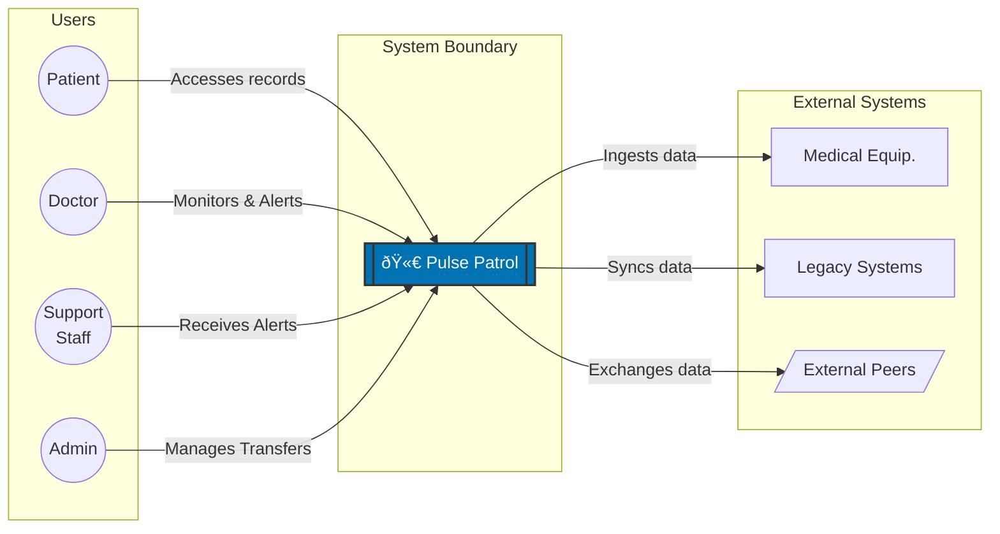
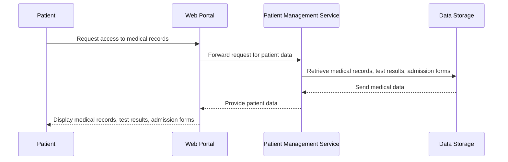
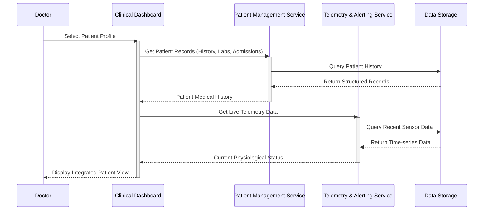
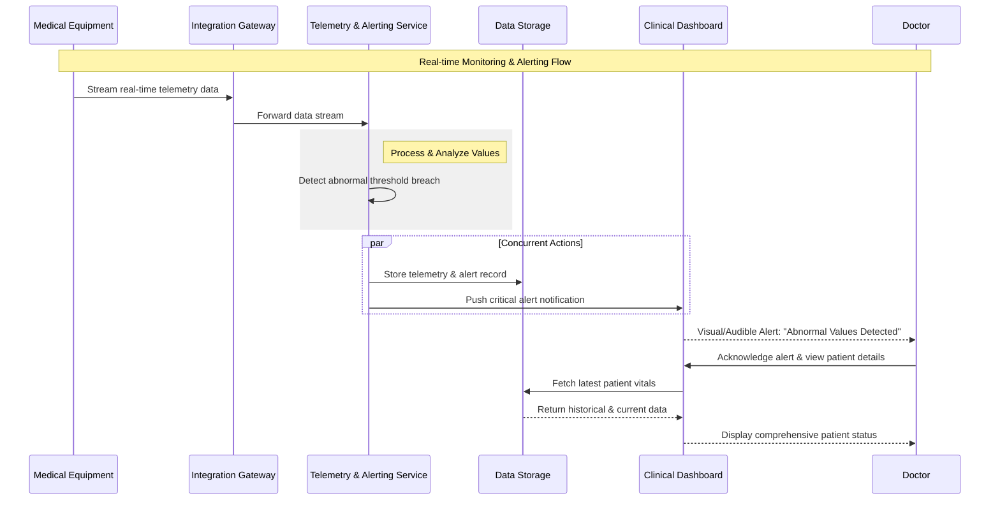
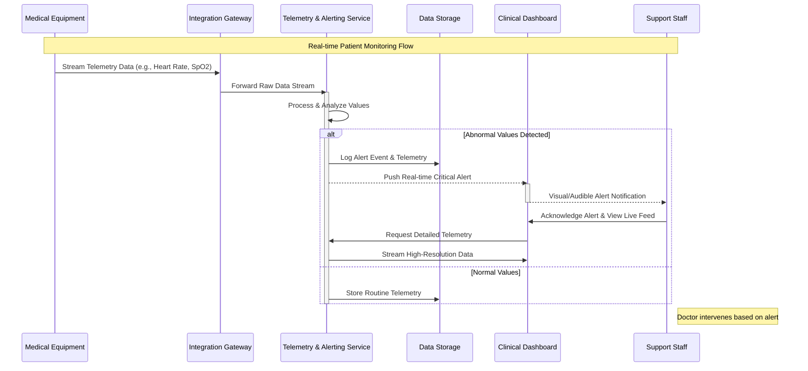
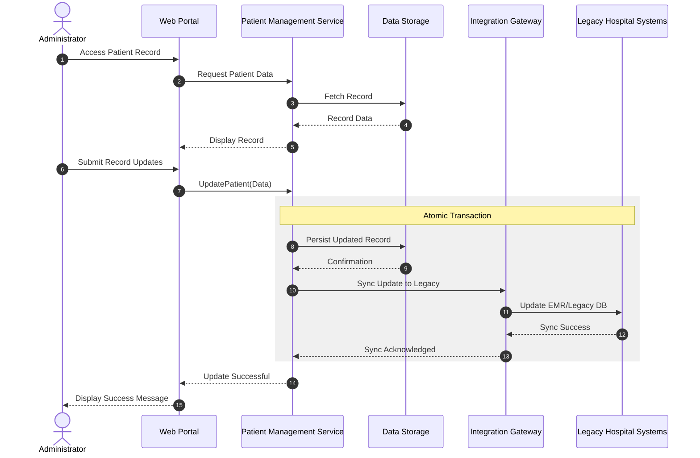
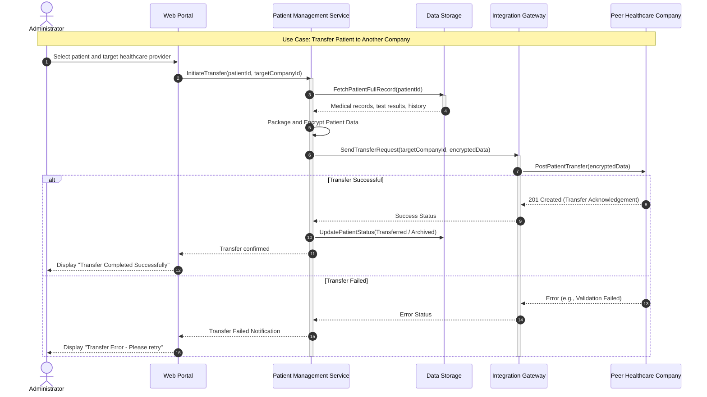

# Architecture Decision Record - H2.v1

> **Pulse Patrol**
>
> *Develop a software system for healthcare that collects and manages patient data,
> integrates with medical equipment, provides web access for patients and authorized personnel,
> alerts staff for abnormal values, and supports patient transfers between healthcare providers.*

<!-- TOC -->
* [Architecture Decision Record - H2.v1](#architecture-decision-record---h2v1)
  * [1. Context](#1-context)
    * [Scope](#scope)
      * [Personas](#personas)
      * [Use cases](#use-cases)
          * [Use Case 1 (Patient)](#use-case-1-patient)
          * [Use Case 2 (Doctor)](#use-case-2-doctor)
          * [Use Case 3 (Doctor)](#use-case-3-doctor)
          * [Use Case 4 (Support Staff)](#use-case-4-support-staff)
          * [Use Case 5 (Administrator)](#use-case-5-administrator)
          * [Use Case 6 (Administrator)](#use-case-6-administrator)
      * [System boundary (context diagram)](#system-boundary-context-diagram)
      * [Deployable units (container diagram)](#deployable-units-container-diagram)
      * [Use Case Realization (sequence diagrams)](#use-case-realization-sequence-diagrams)
          * [Use Case 1 (Patient)](#use-case-1-patient-1)
          * [Use Case 2 (Doctor)](#use-case-2-doctor-1)
          * [Use Case 3 (Doctor)](#use-case-3-doctor-1)
          * [Use Case 4 (Support Staff)](#use-case-4-support-staff-1)
          * [Use Case 5 (Administrator)](#use-case-5-administrator-1)
          * [Use Case 6 (Administrator)](#use-case-6-administrator-1)
    * [Out of Scope](#out-of-scope)
  * [2. Alternatives](#2-alternatives)
      * [Data flows](#data-flows)
  * [3. Decision](#3-decision)
  * [4. Consequences](#4-consequences)
<!-- TOC -->

## 1. Context

**Business Requirements** - develop a software system that:

1. Collects data about patients: medical records, test results, admission forms, etc.
2. Collects data from medical equipment used for investigations.
3. The data is accessible to patients through a web application.
4. Doctors and authorized personnel have access to the data of patients admitted to the hospitals where they work.
5. The system allows for alerting medical staff when monitoring systems detect abnormal values.
6. The system can be sold to various healthcare companies and facilitates the transfer of patients from one to another.

### Scope

[//]: # (<< What is the problem we are trying to solve >>)

#### Personas

1. **Patient**: Individual receiving medical care or treatment.
    - R3: Patients require access to their health data via a web application.

2. **Doctor**: Medical professional providing care to patients.
    - R4: Doctors require access to the data of patients admitted to the hospitals where they work.
    - R5: They need to receive alerts to respond quickly to patient needs.

3. **Support Staff**: Support personnel assisting in patient care (e.g. nurses).
    - R5: Medical staff need alerts for abnormal values in patient monitoring.

4. **Administrator**: Manager overseeing the healthcare operation.
    - R1: Administrators need to manage patient records effectively.
    - R6: They facilitate patient transfers and ensure proper data handling.

#### Use cases

###### Use Case 1 (Patient)

As a **Patient**,
I want **to access my medical records, test results, and admission forms through a web application**,
so that **I can stay informed about my health status and treatment progress**.

###### Use Case 2 (Doctor)

As a **Doctor**,
I want **to access the data of my patients admitted to the hospital**,
so that **I can provide informed medical care based on their history and current status**.

###### Use Case 3 (Doctor)

As a **Doctor**,
I want **to receive alerts for abnormal values detected by monitoring systems**,
so that **I can respond quickly to critical patient needs and improve outcomes**.

###### Use Case 4 (Support Staff)

As a **Support Staff Member**,
I want **to receive alerts for abnormal values in patient monitoring**,
so that **I can act swiftly to provide necessary medical assistance and ensure patient safety**.

###### Use Case 5 (Administrator)

As an **Administrator**,
I want **to manage patient records effectively**,
so that **I can maintain accurate and up-to-date information for efficient healthcare management**.

###### Use Case 6 (Administrator)

As an **Administrator**,
I want **to facilitate the transfer of patients between healthcare companies**,
so that **I can ensure continuity of care and proper handling of patient data**.

#### System boundary (context diagram)

External entities for the Pulse Patrol system:

- *Human Actors*
    - **Patient** - views personal medical history, test results, and treatment progress via the web portal
    - **Doctor** - accesses patient data within their hospital and receives critical physiological alerts
    - **Support Staff Member** - nurses/assistants who receive real-time alerts for abnormal patient monitoring values
    - **Administrator** - manages records, oversees data integrity, and initiates inter-company patient transfers
- *External Systems*
    - **Medical Equipment** - IoT devices and monitoring hardware (e.g., bedside monitors, ventilators) that stream
      real-time telemetry
    - **Legacy Hospital Systems** - existing legacy databases or EMRs where admission forms and historical medical
      records may reside
    - **External Healthcare Companies Peer** - systems belonging to other providers that receive or send patient data
      during a transfer

#### Deployable units (container diagram)

The system will be decomposed into the following functional deployment units / containers:

- **Web Portal**: Interface for Patients to view records and for Administrators to manage data.
- **Clinical Dashboard**: Specialized interface for Doctors and Support Staff to monitor live telemetry and patient
  data.
- **Patient Management Service**: Core logic for medical records, admission forms, and inter-company transfers.
- **Telemetry & Alerting Service**: Processes real-time data from medical equipment and triggers notifications for
  abnormal values.
- **Data Storage**: Centralized repository for structured medical records and time-series telemetry data.
- **Integration Gateway**: Handles communication with Legacy Systems, Medical Equipment, and Peer Healthcare Companies.

#### Use Case Realization (sequence diagrams)

###### Use Case 1 (Patient)

As a **Patient**,
I want **to access my medical records, test results, and admission forms through a web application**,
so that **I can stay informed about my health status and treatment progress**.

###### Use Case 2 (Doctor)

As a **Doctor**,
I want **to access the data of my patients admitted to the hospital**,
so that **I can provide informed medical care based on their history and current status**.

###### Use Case 3 (Doctor)

As a **Doctor**,
I want **to receive alerts for abnormal values detected by monitoring systems**,
so that **I can respond quickly to critical patient needs and improve outcomes**.

###### Use Case 4 (Support Staff)

As a **Support Staff Member**,
I want **to receive alerts for abnormal values in patient monitoring**,
so that **I can act swiftly to provide necessary medical assistance and ensure patient safety**.

###### Use Case 5 (Administrator)

As an **Administrator**,
I want **to manage patient records effectively**,
so that **I can maintain accurate and up-to-date information for efficient healthcare management**.

###### Use Case 6 (Administrator)

As an **Administrator**,
I want **to facilitate the transfer of patients between healthcare companies**,
so that **I can ensure continuity of care and proper handling of patient data**.

### Out of Scope

In the first iteration the system will not have dedicated features for

- advanced data analysis
- marketing campaigns

## 2. Alternatives

<< What are the alternatives considered >>

#### Data flows

- data sources (special handling GDPR)
- data ownership
- data flows

## 3. Decision

<< What alternative was chosen and why >>

## 4. Consequences

<< What are the implications of our decision? What components/systems are impacted and how? >>

