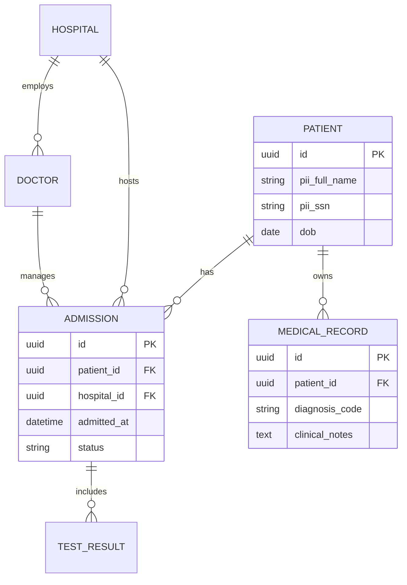

# Architecture Decision Record - v6.1

> **Pulse Patrol**
>
> *Develop a software system for healthcare that collects and manages patient data,
> integrates with medical equipment, provides web access for patients and authorized personnel,
> alerts staff for abnormal values, and supports patient transfers between healthcare providers.*

<!-- TOC -->
* [Architecture Decision Record - v6.1](#architecture-decision-record---v61)
  * [1. Context](#1-context)
    * [Scope](#scope)
    * [Out of Scope](#out-of-scope)
  * [2. Alternatives](#2-alternatives)
  * [3. Decision](#3-decision)
    * [3.1 Logical Schema (Relational - CCRS & CIS)](#31-logical-schema-relational---ccrs--cis)
    * [3.2 Time-Series Schema (Telemetry - VSAS)](#32-time-series-schema-telemetry---vsas)
  * [4. Consequences](#4-consequences)
<!-- TOC -->

## 1. Context

### Scope

[//]: # (<< What is the problem we are trying to solve >>)

The problem is to design a persistence layer that satisfies two conflicting data patterns:

1. **High Integrity & Relational Complexity:** Managing PII/PHI, medical histories, and complex relationships
   (Doctor-Patient-Hospital) while ensuring HIPAA/GDPR compliance.
2. **High-Velocity Ingestion:** Handling continuous streams of telemetry from medical equipment (vitals) that generate
   millions of data points per day, requiring rapid threshold analysis and alerting.

### Out of Scope

[//]: # (<< What other connected issues we don’t plan to solve here. This section is optional >>)

* **Object Storage (S3):** Handling of large binary files (DICOM images, PDFs) is treated as a separate decision.
* **Data Archival:** Long-term "cold" storage strategies for records older than 10 years.

## 2. Alternatives

[//]: # (<< What are the alternatives considered >>)

* **A. Single Relational Database (Monolithic SQL):** Storing both patient records and vitals in a single
  PostgreSQL/MySQL instance.
    * *Cons:* Telemetry data would rapidly bloat indexes, slowing down clinical record lookups.

* **B. NoSQL Only (Document-based):** Using MongoDB or DynamoDB for everything.
    * *Cons:* Difficult to enforce the strict relational integrity needed for medical records and inter-company
      transfers (
      Req 6).

* **C. Polyglot Persistence (CHOSEN):** Using the "right tool for the job"—a Relational Database for business logic and
  a Time-Series Database for telemetry.

## 3. Decision

[//]: # (<< What alternative was chosen and why >>)

We will implement **Polyglot Persistence** with **Database-per-Service** isolation to ensure scalability and regulatory
compliance.

### 3.1 Logical Schema (Relational - CCRS & CIS)

For **Care & Clinical Records (CCRS)** and **Compliance & Identity (CIS)**, we use **Amazon Aurora (PostgreSQL)**.

### 3.2 Time-Series Schema (Telemetry - VSAS)

For **Vital Stream & Alerting (VSAS)**, we use **Amazon Timestream**. Telemetry is stored as a flat, optimized stream.

| Timestamp            | Dimension (PatientID)                | Dimension (DeviceID) | Measure Name | Measure Value |
|----------------------|--------------------------------------|----------------------|--------------|---------------|
| 2026-02-14T10:00:01Z | 9c1bb33e-0a76-4caa-a6f5-308229ba3e3f | EQ-44                | HeartRate    | 72            |
| 2026-02-14T10:00:01Z | df2c3fd9-c051-4e58-9982-b718b10d0786 | EQ-44                | SpO2         | 98            |

## 4. Consequences

[//]: # (<< What are the implications of our decision? What components/systems are impacted and how? >>)

* **Positive (Benefits):**
    * **Performance Isolation:** Intensive vital sign writes do not impact the responsiveness of the web portal for
      patient record viewing.
    * **Regulatory Compliance:** User credentials (CIS) can be encrypted with different keys than medical history
      (CCRS).
    * **Scalability:** Timestream scales automatically to ingest millions of metrics per second.

* **Negative (Trade-offs):**
    * **Distributed Integrity:** We cannot use "JOIN" queries between vitals and patient names. The application layer
      (VSAS) must perform the mapping.
    * **Complexity:** Developers must handle two different query languages (SQL for Aurora, and Timestream's SQL-like
      dialect).
