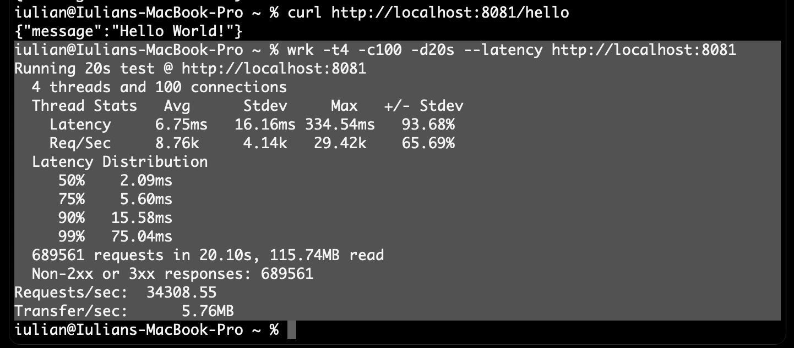

# Performance testing results and recommendations
> **Greeting / sPM**

## Context
> **<span style="font-size: 1.3em">Pulse Patrol</span>**
>
> *Develop a software system for healthcare that collects and manages patient data,
> integrates with medical equipment, provides web access for patients and authorized personnel,
> alerts staff for abnormal values, and supports patient transfers between healthcare providers.*

### System configuration

### Types of tests run

### Purpose


## Results

**Setup**

<p>
  
</p>

**Latency measurement**

*wrk results*
<p>
  
</p>

*SigNoz snapshot*
<p>
  
</p>

*wrk results in text forms*
```
% wrk -t4 -c100 -d20s --latency http://localhost:8081
Running 20s test @ http://localhost:8081
4 threads and 100 connections
Thread Stats   Avg      Stdev     Max   +/- Stdev
Latency     6.75ms   16.16ms 334.54ms   93.68%
Req/Sec     8.76k     4.14k   29.42k    65.69%
Latency Distribution
50%    2.09ms
75%    5.60ms
90%   15.58ms
99%   75.04ms
689561 requests in 20.10s, 115.74MB read
Non-2xx or 3xx responses: 689561
Requests/sec:  34308.55
Transfer/sec:      5.76MB
```


## Recommendations

A list of suggested recommendations
- What will be improved
- What are the expected results
- How can we validate them


