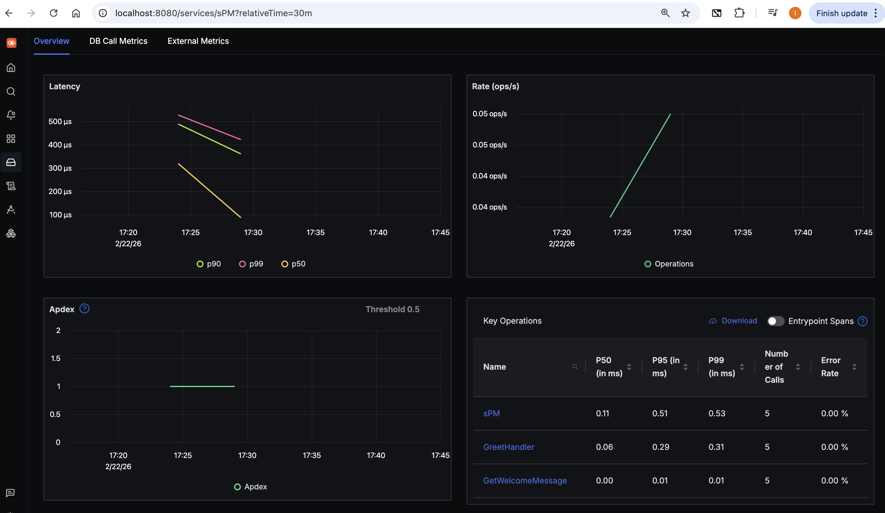
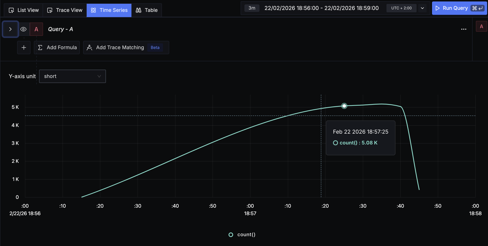
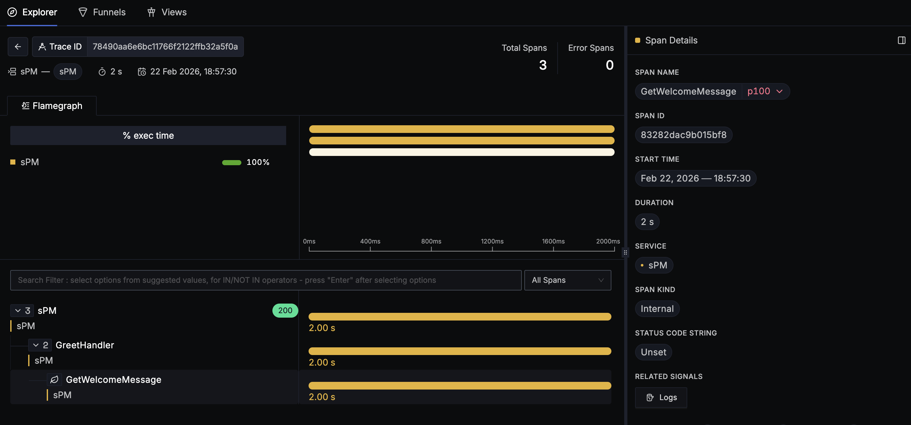
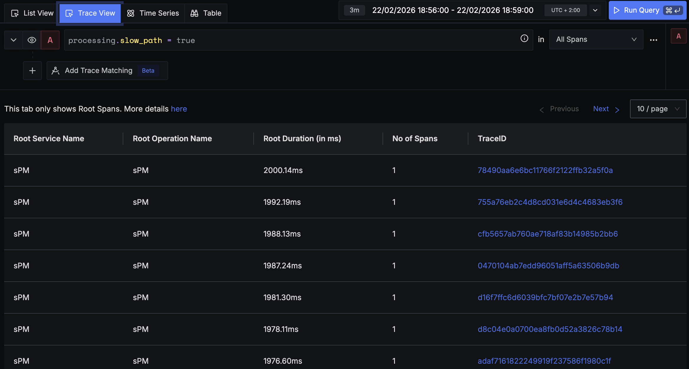

# Performance testing results and recommendations

The source code is available at: https://github.com/iugori/pulse-patrol/tree/main/sPM

> **Greeting / sPM**

<!-- TOC -->
* [Performance testing results and recommendations](#performance-testing-results-and-recommendations)
  * [Context](#context)
    * [System configuration](#system-configuration)
    * [Types of tests run](#types-of-tests-run)
    * [Purpose](#purpose)
  * [Results](#results)
  * [Recommendations](#recommendations)
    * [1. Implement Asynchronous Processing for Health Data](#1-implement-asynchronous-processing-for-health-data)
    * [2. Tail Latency Mitigation via Context Timeouts](#2-tail-latency-mitigation-via-context-timeouts)
<!-- TOC -->

## Context

> **<span style="font-size: 1.3em">Pulse Patrol</span>**
>
> *Develop a software system for healthcare that collects and manages patient data,
> integrates with medical equipment, provides web access for patients and authorized personnel,
> alerts staff for abnormal values, and supports patient transfers between healthcare providers.*


### System configuration

* **Hardware:** MacBook Pro 13-inch (2020), 1.4 GHz Quad-Core Intel i5, 8GB RAM.
* **Service:** Golang REST API running directly via GoLand CLI.
* **Observability Stack:** SigNoz running in Docker.

**Setup**

<p>
  
</p>

### Types of tests run

* **Load/Latency Test:** `wrk` with 4 threads and 100 concurrent connections over 20 seconds.
* **Tracing:** Distributed tracing of the `GetWelcomeMessage` span.

### Purpose

To validate system behavior under high concurrency and ensure instrumentation correctly captures non-deterministic
delays (0–2000ms).

## Results

**Latency Measurement**

The service was subjected to a high-concurrency burst.

| Metric           | Value          | Observation                                          |
|------------------|----------------|------------------------------------------------------|
| **Throughput**   | 340.54 req/sec | Reflects serialized processing due to `time.Sleep`.  |
| **Avg Latency**  | **344.39ms**   | Matches the expected 0-500ms normal distribution.    |
| **P99 Latency**  | **1.68s**      | **Confirmed "Slow Path"** (1000-2000ms delay logic). |
| **Success Rate** | 100%           | No socket or HTTP errors recorded.                   |

*wrk results*

```
% curl http://localhost:8081/hello                   
{"message":"Hello World!"}

% wrk -t4 -c100 -d20s --latency http://localhost:8081/hello
Running 20s test @ http://localhost:8081/hello
  4 threads and 100 connections
  Thread Stats   Avg      Stdev     Max   +/- Stdev
    Latency   344.39ms  320.88ms   1.99s    87.11%
    Req/Sec    85.47     27.46   170.00     71.21%
  Latency Distribution
     50%  289.42ms
     75%  423.44ms
     90%  534.18ms
     99%    1.68s 
  6838 requests in 20.08s, 0.88MB read
  Socket errors: connect 0, read 0, write 0, timeout 1
Requests/sec:    340.54
Transfer/sec:     44.90KB
```

*SigNoz registered request count over time*
<p>
  
</p>

*SigNoz flamegraph*
<p>
  
</p>

*SigNoz slow_path identification*
<p>
  
</p>

## Recommendations

### 1. Implement Asynchronous Processing for Health Data

* **What will be improved:** The **Throughput** (currently limited to ~340 req/sec). In a real-world scenario, blocking
  a request for 2 seconds (the "Slow Path") holds up server resources unnecessarily.
* **Expected results:** Significant increase in requests per second. By moving heavy processing to a background worker
  or using non-blocking I/O, the server can handle more concurrent patient data streams.
* **How can we validate them:** Replace the `time.Sleep` with a **buffered channel** or a **Goroutine worker pool**.
  Re-run the `wrk` test and observe if the "Req/Sec" metric doubles or triples.

### 2. Tail Latency Mitigation via Context Timeouts

* **What will be improved:** The **P99 Latency (1.68s)**. In the **Pulse Patrol** system, a 2-second delay for a
  critical alert is unacceptable.
* **Expected results:** A more predictable response time. Even if the "Slow Path" is triggered, the system should fail
  fast or return a partial result rather than hanging.
* **How can we validate them:** Use `context.WithTimeout` in the Go handler with a **500ms limit**. Validate in
  **SigNoz** by filtering for traces with the attribute `otel.status_code = ERROR` and ensuring no span exceeds 500ms.


